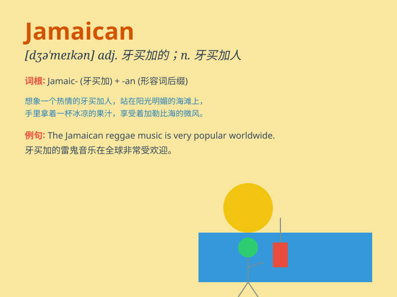

## Jamaican

**英音:** _[dʒəˈmeɪkən]_ **美音:** _[dʒəˈmeɪkən]_

**译义:** *adj.牙买加的；牙买加人的；n.牙买加人*

### 短语

+ **Jamaican rum:** _牙买加朗姆酒_

+ **Jamaican music:** _牙买加音乐_

+ **Jamaican cuisine:** _牙买加美食_

+ **Jamaican athlete:** _牙买加运动员_

+ **Jamaican culture:** _牙买加文化_

### 例句

#### 例句1

> **The Jamaican athlete won the gold medal in the sprint event.**

**中文翻译:** 这位牙买加运动员在短跑项目中赢得了金牌。

**单词释义:** 牙买加的；牙买加人的

#### 例句2

> **She loves Jamaican music and often dances to it.**

**中文翻译:** 她喜欢牙买加音乐，并经常跟着它跳舞。

**单词释义:** 牙买加的

#### 例句3

> **The Jamaican cuisine is known for its spicy flavors.**

**中文翻译:** 牙买加美食以其辛辣的味道而闻名。

**单词释义:** 牙买加的

### 背诵小故事

> A Jamaican man named Tom loved to dance to reggae music. He wore
colorful clothes and had a big smile. His passion for his homeland made
him a symbol of Jamaican spirit.

**一位名叫汤姆的牙买加人喜欢随着雷鬼音乐跳舞。他穿着色彩鲜艳的衣服，脸上洋溢着大大的笑容。他对祖国的热爱使他成为了牙买加精神的象征。**

### 图义

