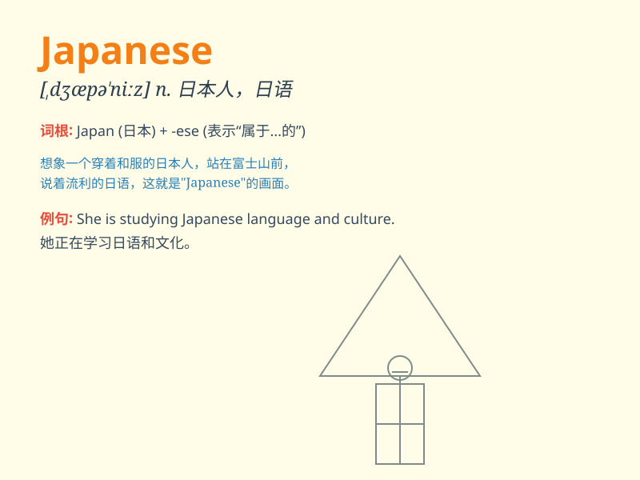

## Japanese

**英音:** _[ˌdʒæpəˈniːz]_ **美音:** _[ˌdʒæpəˈniːz]_

**译义:** *adj.日本的,日本人的,日语的n.日本人,日语*

### 短语

+ **Japanese food:** _日本食物_

+ **Japanese culture:** _日本文化_

+ **Japanese language:** _日语_

+ **Japanese people:** _日本人_

+ **Japanese history:** _日本历史_

### 例句

#### 例句1

> **I\'m interested in Japanese culture.**

**中文翻译:** 我对日本文化感兴趣。

**单词释义:** 日本的；日本人的；日语的

#### 例句2

> **She is learning Japanese at school.**

**中文翻译:** 她正在学校学习日语。

**单词释义:** 日语

#### 例句3

> **The Japanese food is very delicious.**

**中文翻译:** 日本食物非常美味。

**单词释义:** 日本的

### 背诵小故事

> 想象一下，你去了一家日本餐厅，里面的服务员都很热情，他们说着 Japanese
欢迎你。你品尝了美味的寿司，感受着独特的 Japanese
文化。这时你就记住了，Japanese 就是日本的、日本人、日语的意思。

**想象一下，您去了一家日本餐厅，里面的服务员都很热情，他们说着日语欢迎您。您品尝了美味的寿司，感受着独特的日本文化。这时您就记住了，Japanese
就是日本的、日本人、日语的意思。**

### 图义

