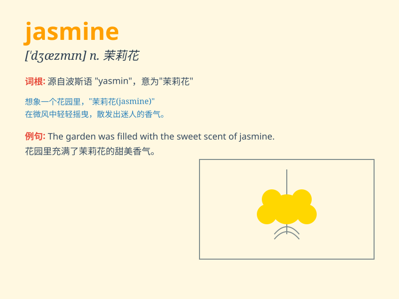

## jasmine

**英音:** _[\'dʒæzmɪn; \'dʒæs-]_ **美音:** _[\'dʒæzmɪn]_

**译义:** *n.茉莉,素馨,淡黄色*

### 短语

+ **jasmine tea:** _茉莉花茶_

+ **jasmine flower:** _茉莉花_

+ **sweet jasmine:** _香甜的茉莉_

+ **white jasmine:** _白色茉莉_

+ **fragrant jasmine:** _芳香的茉莉_

### 例句

#### 例句1

> **The jasmine flowers filled the garden with a sweet fragrance.**

**中文翻译:** 茉莉花使花园充满了甜美的香气。

**单词释义:** 茉莉花

#### 例句2

> **She wore a dress decorated with jasmine patterns.**

**中文翻译:** 她穿着一件带有茉莉花纹样的连衣裙。

**单词释义:** 茉莉（花）

#### 例句3

> **The jasmine tea has a refreshing taste.**

**中文翻译:** 茉莉花茶有一种清新的味道。

**单词释义:** 茉莉（花）

### 背诵小故事

> A girl named Lily was walking in the garden. Suddenly, she smelled a
sweet fragrance. It was from the jasmine flowers. The white jasmine
looked so beautiful and made her day.

**一个叫莉莉的女孩在花园里散步。突然，她闻到一股甜香。这香味来自茉莉花。白色的茉莉看起来如此美丽，让她心情愉悦。**

### 图义

