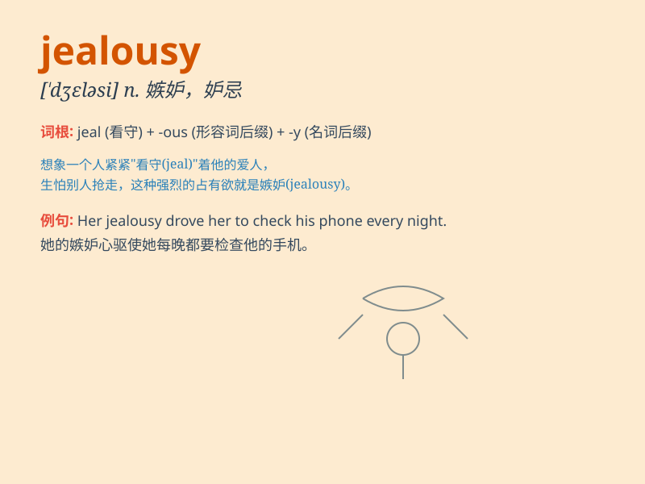

## jealousy

**英音:** _[\'dʒeləsɪ]_ **美音:** _[\'dʒɛləsi]_

**译义:** *n.嫉妒*

### 短语

+ **be consumed by jealousy:** _被嫉妒所吞噬_

+ **feel jealousy:** _感到嫉妒_

+ **arouse jealousy:** _引起嫉妒_

+ **jealousy among friends:** _朋友间的嫉妒_

+ **overcome jealousy:** _克服嫉妒_

### 例句

#### 例句1

> **Her jealousy of her sister\'s success led to constant
arguments.**

**中文翻译:** 她对姐姐成功的嫉妒导致了不断的争吵。

**单词释义:** 嫉妒

#### 例句2

> **He felt a pang of jealousy when he saw his friend\'s new car.**

**中文翻译:** 当他看到朋友的新车时，他感到一阵嫉妒。

**单词释义:** 嫉妒；妒忌

#### 例句3

> **Jealousy is a destructive emotion that can ruin
relationships.**

**中文翻译:** 嫉妒是一种具有破坏性的情绪，它会毁掉关系。

**单词释义:** 嫉妒；忌妒

### 背诵小故事

> Once there were two friends. One got a new toy and the other felt
jealousy. He couldn\'t enjoy his own things because of this negative
feeling. Jealousy made him unhappy.

**从前有两个朋友。一个得到了一个新玩具，另一个感到嫉妒。因为这种负面情绪，他无法享受自己拥有的东西。嫉妒让他不开心。**

### 图义

