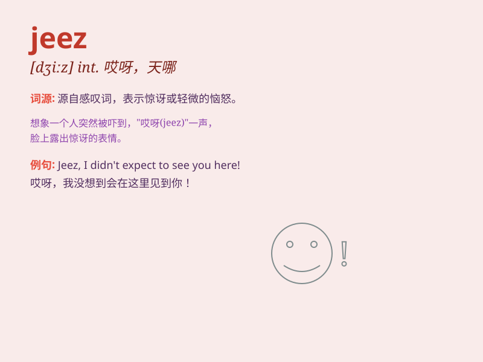

## jeez

**英音:** _[dʒiːz]_ **美音:** _[dʒiːz]_

**译义:** *int.呀*

### 短语

+ **Jeez Louise:** _表示惊讶、沮丧或不耐烦_

+ **oh jeez:** _表示惊讶、烦恼或无奈_

+ **Jeez, I\'m tired:** _天哪，我累了_

+ **Jeez, that\'s hard:** _哎呀，那太难了_

+ **Jeez, what a mess:** _天哪，真是一团糟_

### 例句

#### 例句1

> **Jeez, I can\'t believe I forgot my keys again.**

**中文翻译:** 哎呀，我真不敢相信我又忘带钥匙了。

**单词释义:** 表示惊讶、沮丧或烦恼

#### 例句2

> **Jeez, that was a close call!**

**中文翻译:** 天哪，那真是千钧一发！

**单词释义:** 表达惊叹或紧张

#### 例句3

> **Jeez, don\'t be so hard on yourself.**

**中文翻译:** 哎呀，别对自己这么苛刻。

**单词释义:** 表示安慰或劝解

### 背诵小故事

>
想象一下，你正在参加一场紧张的考试，时间快到了却还有很多题没做，这时你忍不住喊出'Jeez！'来表达你的惊讶和焦急。

**想象你在考试时因时间紧迫而喊出'Jeez！'来表达惊讶和焦急**

### 图义

