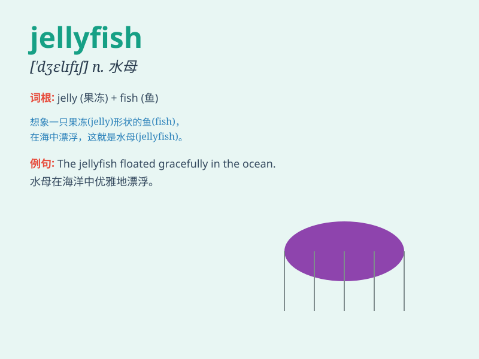

## jellyfish

**英音:** _[\'dʒelɪfɪʃ]_ **美音:** _[\'dʒɛlɪfɪʃ]_

**译义:** *n.水母*

### 短语

+ **box jellyfish:** _箱形水母_

+ **jellyfish sting:** _水母蜇伤_

+ **poisonous jellyfish:** _有毒水母_

+ **jellyfish swarm:** _水母群_

+ **giant jellyfish:** _巨型水母_

### 例句

#### 例句1

> **I saw a jellyfish while swimming in the ocean.**

**中文翻译:** 我在海里游泳的时候看到了一只水母。

**单词释义:** 水母

#### 例句2

> **The jellyfish stung me and it was very painful.**

**中文翻译:** 那只水母蜇了我，非常疼。

**单词释义:** 水母

#### 例句3

> **Some jellyfish glow in the dark, which is quite amazing.**

**中文翻译:** 有些水母在黑暗中发光，这相当令人惊奇。

**单词释义:** 水母

### 背诵小故事

> One day, a little girl was swimming in the sea. Suddenly, she saw a
strange creature. It was like jelly and had many tentacles. Later she
knew it was a jellyfish. The jellyfish was so beautiful but could sting.

**有一天，一个小女孩在海里游泳。突然，她看到一个奇怪的生物。它像果冻一样，还有很多触手。后来她知道这是一只水母。水母很漂亮但会蜇人。**

### 图义

