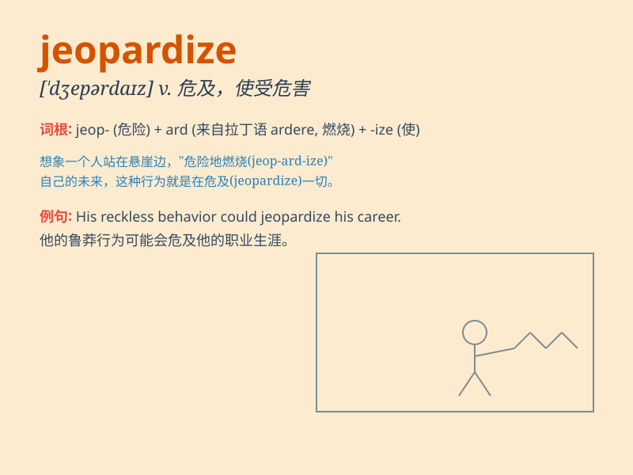

## jeopardize

**英音:** _[\'dʒepədaɪz]_ **美音:** _[\'dʒɛpɚdaɪz]_

**译义:** *v.危害*

### 短语

+ **jeopardize one\'s career:** _危及某人的职业生涯_

+ **jeopardize the project:** _危及这个项目_

+ **jeopardize relations:** _危及关系_

+ **jeopardize safety:** _危及安全_

+ **jeopardize chances:** _危及机会_

### 例句

#### 例句1

> **The bad weather jeopardized our hiking trip.**

**中文翻译:** 恶劣的天气危及了我们的徒步旅行。

**单词释义:** 危及；损害

#### 例句2

> **His mistake could jeopardize the entire project.**

**中文翻译:** 他的错误可能会危及整个项目。

**单词释义:** 危及；使处于危险境地

#### 例句3

> **Reckless driving may jeopardize your life and the lives of
others.**

**中文翻译:** 鲁莽驾驶可能会危及你和他人的生命。

**单词释义:** 使遭受危险；危害

### 背诵小故事

> A brave adventurer was on a quest. But one wrong step could
jeopardize the entire journey. He had to be very careful not to lose the
precious treasure and fail the mission.

**一位勇敢的冒险家正在探险。但一个错误的步骤可能会危及整个旅程。他必须非常小心，以免失去珍贵的宝藏并导致任务失败。**

### 图义

