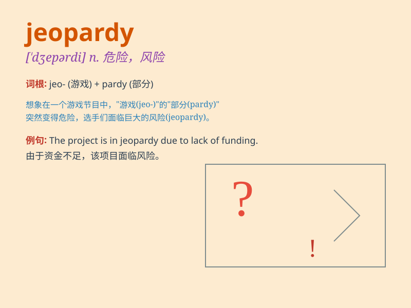

## jeopardy

**英音:** _[\'dʒepədɪ]_ **美音:** _[\'dʒɛpɚdi]_

**译义:** *n.危险,危险*

### 短语

+ **in jeopardy:** _处于危险中_

+ **put something in jeopardy:** _使某物处于危险境地_

+ **jeopardy of losing:** _失去的危险_

+ **face jeopardy:** _面临危险_

+ **escape jeopardy:** _逃脱危险_

### 例句

#### 例句1

> **His life was in jeopardy after the accident.**

**中文翻译:** 事故发生后，他的生命处于危险之中。

**单词释义:** 危险；危难

#### 例句2

> **The company\'s future is in jeopardy due to poor management.**

**中文翻译:** 由于管理不善，公司的未来处于危险之中。

**单词释义:** 危险；风险

#### 例句3

> **Putting the project at jeopardy was not a wise decision.**

**中文翻译:** 使这个项目处于危险境地不是一个明智的决定。

**单词释义:** 危及；使遭受危险

### 背诵小故事

> A brave adventurer was on a quest for a hidden treasure. But he was
in jeopardy as he got lost in a dangerous cave. Just when hope seemed
lost, he found a way out. Jeopardy means danger or risk.

**一位勇敢的冒险家在寻找隐藏的宝藏。但他陷入了危险，在一个危险的洞穴中迷路了。就在希望似乎破灭的时候，他找到了出路。jeopardy
意思是危险或风险。**

### 图义

