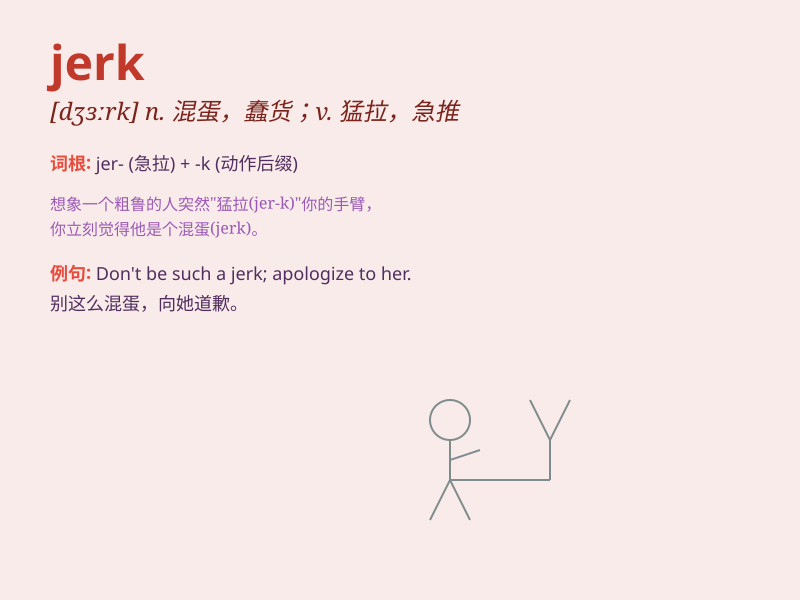

## jerk

**英音:** _[dʒɜːk]_ **美音:** _[dʒɝk]_

**译义:**
*n.性情古怪的人,急推,猛拉,肌肉抽搐,(生理)反射,牛肉干vi.痉挛,急拉,颠簸地行进vt.猛拉*

### 短语

+ **jerk around:** _欺骗；耍弄；敷衍_

+ **jerk off:** _行手淫；（俚语）偷懒，混日子_

+ **jerk out:** _突然说出；猛地拉出_

+ **jerk somebody around:** _给某人找麻烦；对某人不诚实_

+ **clean jerk:** _挺举（举重的一种方式）_

### 例句

#### 例句1

> **He gave the rope a jerk.**

**中文翻译:** 他猛拉了一下绳子。

**单词释义:** 猛拉

#### 例句2

> **The bus jerked to a halt.**

**中文翻译:** 公共汽车颠簸着停了下来。

**单词释义:** 颠簸；急拉

#### 例句3

> **Don\'t be such a jerk!**

**中文翻译:** 别这么混！

**单词释义:** 蠢人；混蛋

### 背诵小故事

> One day, I saw a guy on the street who moved in a very strange way.
His sudden and rough movements made him look like a jerk. Later I
learned that \'jerk\' means someone who behaves rudely or strangely.

**有一天，我在街上看到一个家伙，他的动作非常奇怪。他突然又粗鲁的动作让他看起来像个傻瓜。后来我才知道，\'jerk\'意思是行为粗鲁或奇怪的人。**

### 图义

