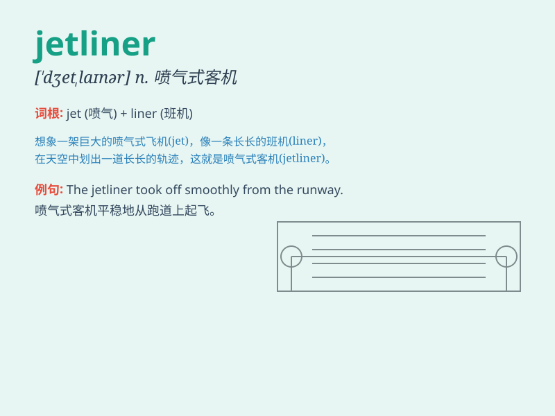

## jetliner

**英音:** _[\'dʒetlaɪnə]_ **美音:** _[\'dʒɛtlaɪnɚ]_

**译义:** *n.喷气客机*

### 短语

+ **commercial jetliner:** _商用喷气式客机_

+ **passenger jetliner:** _客运喷气式客机_

+ **long-haul jetliner:** _长途喷气式客机_

+ **wide-body jetliner:** _宽体喷气式客机_

+ **domestic jetliner:** _国内喷气式客机_

### 例句

#### 例句1

> **The jetliner took off smoothly and headed towards its
destination.**

**中文翻译:** 这架喷气式客机平稳起飞，朝着目的地飞去。

**单词释义:** 喷气式客机

#### 例句2

> **The new jetliner is equipped with the latest technology for a
more comfortable flight.**

**中文翻译:**
这架新的喷气式客机配备了最新的技术，以实现更舒适的飞行。

**单词释义:** 喷气式客机

#### 例句3

> **Due to bad weather, the jetliner was forced to land at an
alternate airport.**

**中文翻译:** 由于恶劣天气，这架喷气式客机被迫在备用机场降落。

**单词释义:** 喷气式客机

### 背诵小故事

> Imagine a super-fast jet moving in a straight line. Now, add many
seats and facilities inside. That\'s a jetliner! It takes people on long
journeys across the sky, like a magic flying home.

**想象一下一架超快的喷气式飞机在直线飞行。现在，在里面加上许多座位和设施。这就是喷气式客机！它带着人们在空中进行长途旅行，就像一个神奇的飞行之家。**

### 图义

