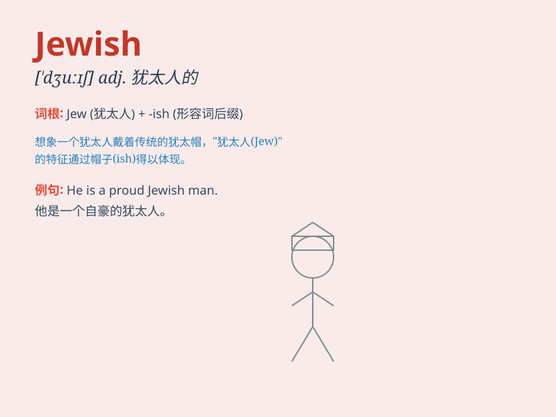

## Jewish

**英音:** _[ˈdʒuːɪʃ]_ **美音:** _[ˈdʒuːɪʃ]_

**译义:** *adj.犹太人的；犹太教的*

### 短语

+ **Jewish community:** _犹太社区_

+ **Jewish culture:** _犹太文化_

+ **Jewish religion:** _犹太宗教_

+ **Jewish festival:** _犹太节日_

+ **Jewish history:** _犹太历史_

### 例句

#### 例句1

> **She is of Jewish descent.**

**中文翻译:** 她有犹太血统。

**单词释义:** 犹太的

#### 例句2

> **The Jewish community in this city is very active.**

**中文翻译:** 这个城市的犹太社区非常活跃。

**单词释义:** 犹太的

#### 例句3

> **He follows Jewish customs and traditions.**

**中文翻译:** 他遵循犹太的习俗和传统。

**单词释义:** 犹太的

### 背诵小故事

> A Jewish boy named David loved reading Torah. One day, he found a
precious old scroll and shared it with his community. His love for his
faith and the scroll showed his deep Jewish roots.

**一个叫大卫的犹太男孩喜欢读《托拉》。有一天，他发现了一个珍贵的旧卷轴，并与他的社区分享。他对自己信仰的热爱和这个卷轴显示了他深深的犹太根源。**

### 图义

