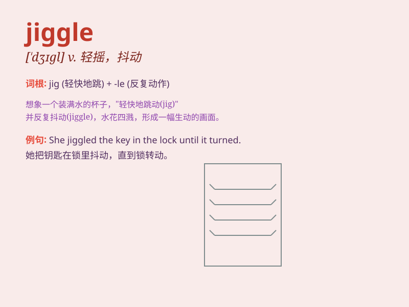

## jiggle

**英音:** _[\'dʒɪg(ə)l]_ **美音:** _[\'dʒɪɡl]_

**译义:** *v.(使)轻摇,(使)微动n.轻摇,微动*

### 短语

+ **jiggle the handle:** _轻轻摇动把手_

+ **jiggle the lock:** _轻轻摇动锁_

+ **jiggle the key:** _轻轻摇动钥匙_

+ **jiggle the wires:** _轻轻摇动电线_

+ **jiggle the button:** _轻轻摇动按钮_

### 例句

#### 例句1

> **She couldn\'t help giggling when she saw him jiggle the keys.**

**中文翻译:** 当她看到他晃动钥匙时，她忍不住咯咯地笑了。

**单词释义:** （使）轻轻摇晃，抖动

#### 例句2

> **The baby\'s chubby legs jiggle as she kicks happily.**

**中文翻译:** 宝宝开心地踢腿时，胖乎乎的腿在抖动。

**单词释义:** 抖动，晃动

#### 例句3

> **He tried to jiggle the lock to open the door.**

**中文翻译:** 他试图轻轻晃动锁来打开门。

**单词释义:** 轻轻摇晃

### 背诵小故事

> One day, I was walking in the park and saw a little girl holding a
big lollipop. She was so excited that her hand started to jiggle, making
the lollipop move up and down. It was so funny!

**有一天，我在公园散步，看到一个小女孩拿着一个大棒棒糖。她太兴奋了，手开始抖动，使得棒棒糖上下晃动。太有趣了！**

### 图义

