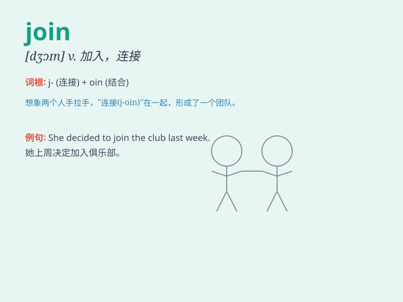

## join

**英音:** _[dʒɒɪn]_ **美音:** _[dʒɔɪn]_

**译义:**
*vi.参加,结合,加入vt.连接,结合,参加,加入n.连接,结合,接合点 [计]
用子目录名取代驱动器符*

### 短语

+ **join in:** _参加；加入_

+ **join up:** _参军；入伍_

+ **join forces:** _联合；合作_

+ **join hands:** _携手；联手_

+ **join together:** _连接；结合_

### 例句

#### 例句1

> **I want to join the music club.**

**中文翻译:** 我想加入音乐俱乐部。

**单词释义:** 加入

#### 例句2

> **The two rivers join at the city center.**

**中文翻译:** 两条河流在市中心汇合。

**单词释义:** 交汇；汇合

#### 例句3

> **Will you join us for dinner?**

**中文翻译:** 你愿意和我们一起吃晚饭吗？

**单词释义:** 和......一起

### 背诵小故事

> One day, Tom and Jerry decided to join a party. They walked together,
hand in hand. When they arrived, they found many friends and had a great
time. Join means to come together or be part of something.

**有一天，汤姆和杰瑞决定参加一个聚会。他们手牵手一起走。当他们到达时，他们发现了很多朋友并且玩得很开心。join
意思是一起参加或成为某物的一部分。**

### 图义

