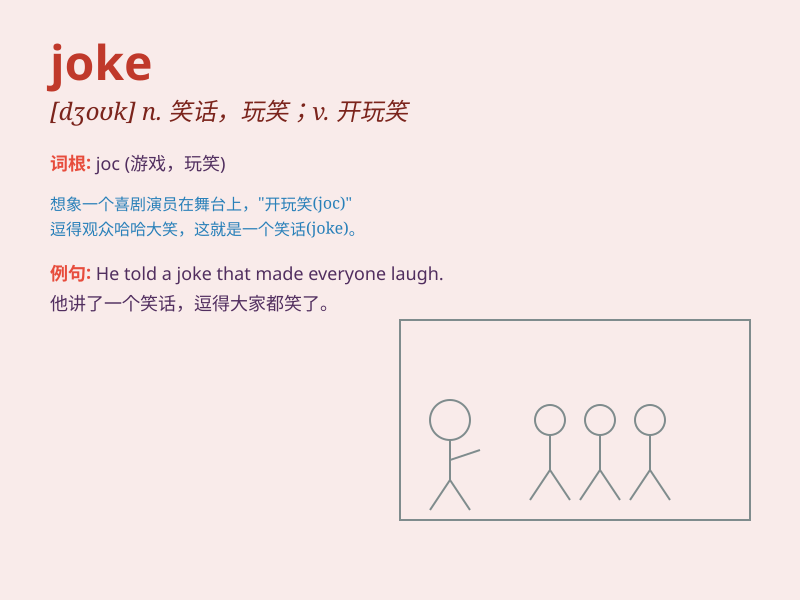

## joke

**英音:** _[dʒəʊk]_ **美音:** _[dʒok]_

**译义:** *n.笑话,玩笑v.(和\...)开玩笑*

### 短语

+ **play a joke:** _开玩笑_

+ **tell a joke:** _讲笑话_

+ **crack a joke:** _说笑话_

+ **joke around:** _闹着玩；开玩笑_

+ **no joke:** _不是闹着玩的；严肃的事_

### 例句

#### 例句1

> **He told a funny joke and everyone laughed.**

**中文翻译:** 他讲了一个有趣的笑话，大家都笑了。

**单词释义:** 笑话

#### 例句2

> **Are you joking? I can\'t believe it.**

**中文翻译:** 你在开玩笑吗？我简直不敢相信。

**单词释义:** 开玩笑

#### 例句3

> **She has a great sense of humor and always makes jokes.**

**中文翻译:** 她很有幽默感，总是开玩笑。

**单词释义:** 笑话

### 背诵小故事

> One day, Tom told a funny joke to his friends. Everyone laughed
loudly. The joke was about a monkey and a banana. It made their day.
Remember, a joke can bring joy and laughter.

**有一天，汤姆给他的朋友们讲了一个有趣的笑话。每个人都大声笑了。这个笑话是关于一只猴子和一根香蕉的。它让他们度过了美好的一天。记住，笑话能带来欢乐和笑声。**

### 图义

