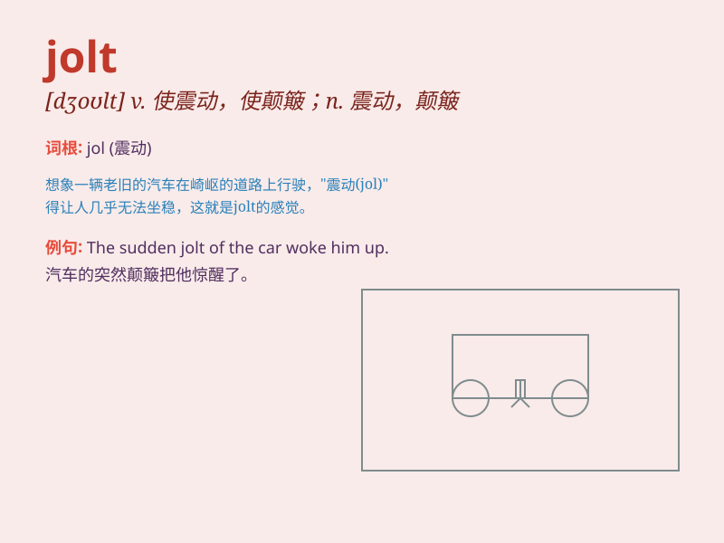

## jolt

**英音:** _[dʒəʊlt; dʒɒlt]_ **美音:** _[dʒolt]_

**译义:** *v.摇晃n.摇晃*

### 短语

+ **give someone a jolt:** _使某人震惊_

+ **jolt out of:** _从\...中猛地摇晃出来_

+ **jolt awake:** _猛然惊醒_

+ **jolt into action:** _使突然行动起来_

+ **a jolt of electricity:** _一股电流_

### 例句

#### 例句1

> **The sudden jolt of the earthquake threw everyone off balance.**

**中文翻译:** 突如其来的地震让所有人都失去了平衡。

**单词释义:** 震动；颠簸

#### 例句2

> **The bad news gave her a jolt.**

**中文翻译:** 这个坏消息让她震惊不已。

**单词释义:** 使震惊；使受到刺激

#### 例句3

> **The car jolted along the rough road.**

**中文翻译:** 汽车在崎岖不平的路上颠簸。

**单词释义:** （使）颠簸；（使）摇动

### 背诵小故事

> One day, I was sitting on a bumpy bus. Suddenly, it hit a big pothole
and gave me a jolt. I was shaken and almost fell off my seat. The
unexpected jolt made me realize how this word means a sudden, rough
movement.

**有一天，我坐在一辆颠簸的公交车上。突然，它撞上了一个大坑，给了我一个剧烈的震动。我被晃了一下，差点从座位上摔下来。这意外的震动让我明白了
jolt 这个词是指突然、猛烈的移动。**

### 图义

