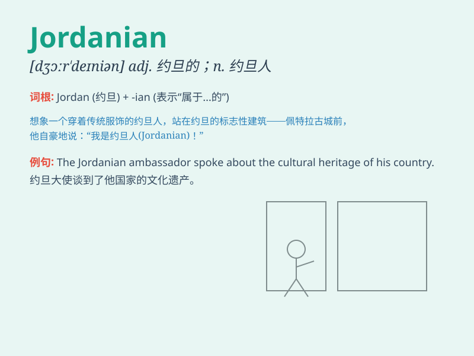

## Jordanian

**英音:** _[dʒɔːrˈdeɪniən]_ **美音:** _[dʒɔːrˈdeɪniən]_

**译义:** *adj.约旦的；约旦人的 n.约旦人*

### 短语

+ **Jordanian dinar:** _约旦第纳尔（约旦货币）_

+ **Jordanian embassy:** _约旦大使馆_

+ **Jordanian cuisine:** _约旦美食_

+ **Jordanian culture:** _约旦文化_

+ **Jordanian government:** _约旦政府_

### 例句

#### 例句1

> **The Jordanian government is working on improving the economy.**

**中文翻译:** 约旦政府正在致力于改善经济。

**单词释义:** 约旦的；约旦人的

#### 例句2

> **She married a Jordanian man and moved to Amman.**

**中文翻译:** 她嫁给了一个约旦男人并搬到了安曼。

**单词释义:** 约旦的；约旦人的

#### 例句3

> **The Jordanian cuisine is known for its rich flavors.**

**中文翻译:** 约旦美食以其丰富的口味而闻名。

**单词释义:** 约旦的

### 背诵小故事

> Imagine a traveler named Jordan who loves exploring. One day, he
decided to represent his country in an international event. People
started calling him a Jordanian. It means someone from Jordan.

**想象有个叫乔丹的旅行者，热爱探索。有一天，他决定代表自己的国家参加国际活动。人们开始称他为
Jordanian。这个词意思是来自约旦的人。**

### 图义

