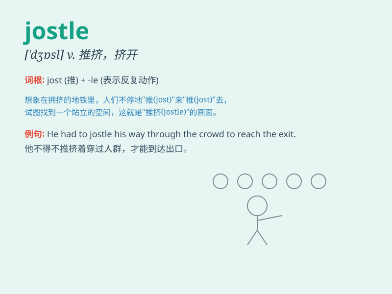

## jostle

**英音:** _[\'dʒɒs(ə)l]_ **美音:** _[\'dʒɑsl]_

**译义:** *v.挤,推,争夺n.挤拥,推撞*

### 短语

+ **jostle for:** _争夺；争抢_

+ **jostle with:** _与\...\...推挤；与\...\...拥挤_

+ **jostle along:** _拥挤着前行_

+ **jostle one\'s way:** _挤着前进_

+ **jostle someone aside:** _把某人挤到一边_

### 例句

#### 例句1

> **People jostled each other in the crowded market.**

**中文翻译:** 拥挤的市场里，人们互相推挤。

**单词释义:** 推挤；挤撞

#### 例句2

> **The passengers jostled for space on the bus.**

**中文翻译:** 乘客们在公共汽车上争抢空间。

**单词释义:** 争抢；争夺

#### 例句3

> **The reporters jostled to get the best position for the
interview.**

**中文翻译:** 记者们争相抢占最佳采访位置。

**单词释义:** 推搡；挤来挤去

### 背诵小故事

> One day at the crowded market, people were jostling each other to get
to the best stalls. Tom was pushed around and had a hard time moving
forward. \'Jostle\' means to push and shove roughly in a crowd.

**有一天在拥挤的市场，人们互相推挤着去最好的摊位。汤姆被推来搡去，很难前进。'jostle'这个单词意思是在人群中粗暴地推挤。**

### 图义

