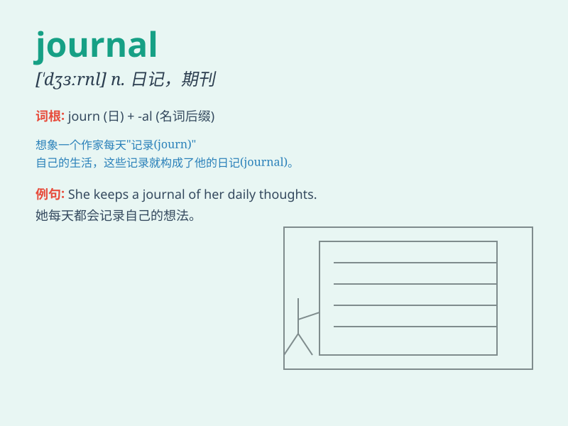

## journal

**英音:** _[ˈdʒəːn(ə)l]_ **美音:** _[ˈdʒɜrnəl]_

**译义:** *n.定期刊物,杂志,航海日记,分类账*

### 短语

+ **trade journal:** _行业杂志_

+ **academic journal:** _学术期刊_

+ **keep a journal:** _写日记_

+ **journals of the proceedings:** _会议记录_

+ **professional journal:** _专业杂志_

### 例句

#### 例句1

> **She keeps a journal of her daily activities.**

**中文翻译:** 她记录自己的日常活动。

**单词释义:** 日记；日志

#### 例句2

> **The scientific journal published his research findings.**

**中文翻译:** 该科学杂志发表了他的研究成果。

**单词释义:** （某学科或专业的）期刊

#### 例句3

> **He wrote an article for the financial journal.**

**中文翻译:** 他为金融杂志写了一篇文章。

**单词释义:** 杂志

### 背诵小故事

>
想象一下，一位勇敢的探险家每天都会在他的日记（journal）中记录冒险经历。有一天，他遇到了大风暴，但他依靠日记中的经验成功脱险。这个日记就像他的秘密武器，承载着宝贵的记忆。

**想象一位探险家在日记中记录冒险，日记成为他的秘密武器，帮助理解单词'journal（日记；期刊；杂志）'**

### 图义

