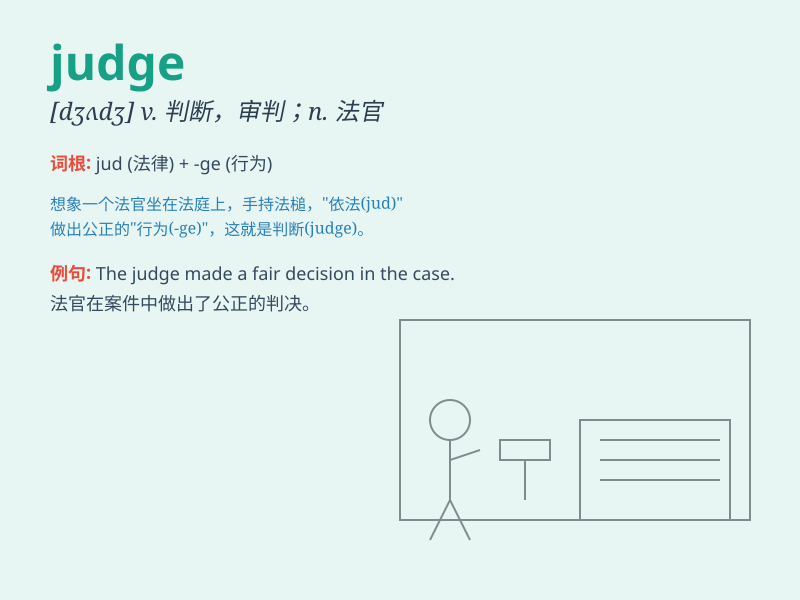

## judge

**英音:** _[dʒʌdʒ]_ **美音:** _[dʒʌdʒ]_

**译义:**
*n.法官,裁判员,评判员,鉴定人vt.审理,鉴定,判断,判决,断定vi.下判断,作评价*

### 短语

+ **judge by:** _根据\...\...判断_

+ **judge from:** _根据\...\...判断_

+ **judge of:** _评价；鉴定_

+ **pass judgment:** _作出判决_

+ **judge between:** _在\...\...之间作出判断_

### 例句

#### 例句1

> **The judge sentenced the criminal to ten years in prison.**

**中文翻译:** 法官判处罪犯十年监禁。

**单词释义:** 法官

#### 例句2

> **Don\'t judge a book by its cover.**

**中文翻译:** 不要以貌取人。

**单词释义:** 判断；评判

#### 例句3

> **It\'s difficult to judge who is right in this matter.**

**中文翻译:** 在这件事情上很难判断谁是对的。

**单词释义:** 判断；断定

### 背诵小故事

> One day, in a courtroom, a wise person named John was asked to judge
a difficult case. He carefully listened to both sides and made a fair
decision based on the facts. John was a great judge.

**一天，在法庭上，一个叫约翰的智者被要求审判一个棘手的案子。他仔细倾听双方陈述，并根据事实做出了公正的裁决。约翰是一位出色的法官。**

### 图义

