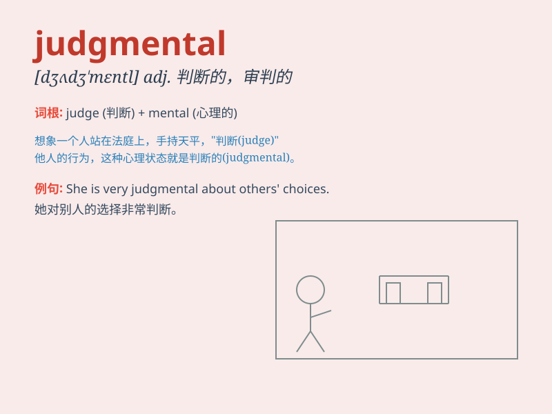

## judgmental

**英音:** _[ˈdʒʌdʒ.məntl]_ **美音:** _[ˈdʒʌdʒ.mən.təl]_

**译义:** *好判断的；爱批评的；自以为是的*

### 短语

+ **be judgmental about:** _对\...\...吹毛求疵_

+ **judgmental attitude:** _评判的态度_

+ **too judgmental:** _太爱评判_

+ **avoid being judgmental:** _避免吹毛求疵_

+ **a judgmental person:** _一个爱评判的人_

### 例句

#### 例句1

> **Don\'t be so judgmental. Everyone makes mistakes.**

**中文翻译:** 别这么爱评判。每个人都会犯错。

**单词释义:** 爱评判的；动辄评头论足的

#### 例句2

> **I find her very judgmental when it comes to other people\'s
choices.**

**中文翻译:** 当涉及到别人的选择时，我发现她非常爱评判。

**单词释义:** 爱批评的；主观判断的

#### 例句3

> **His judgmental attitude caused a lot of tension in the group.**

**中文翻译:** 他爱评判的态度在小组里造成了很多紧张气氛。

**单词释义:** 好批评的；爱下判断的

### 背诵小故事

> One day, Tom was very judgmental and criticized everyone around him.
But when he made a mistake, he realized that being judgmental was not
good. It taught him to be more understanding.

**有一天，汤姆非常爱评判他人，批评他周围的每个人。但当他自己犯错时，他意识到爱评判是不好的。这教会他要更善解人意。**

### 图义

