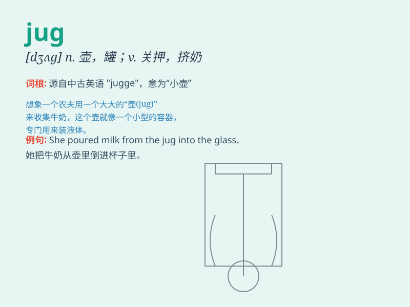

## jug

**英音:** _[dʒʌg]_ **美音:** _[dʒʌɡ]_

**译义:**
*n.水壶,监牢,[象声]模仿夜莺的叫声vt.放入壶中,炖,关押vi.模仿夜莺叫*

### 短语

+ **jug handle:** _（道路的）急转弯_

+ **milk jug:** _牛奶罐_

+ **jug wine:** _大罐葡萄酒_

+ **jug of water:** _一罐水_

+ **jug band:** _（使用自制乐器的）瓶罐乐队_

### 例句

#### 例句1

> **She filled the jug with water.**

**中文翻译:** 她把水罐装满了水。

**单词释义:** 水罐；大壶

#### 例句2

> **The milk jug is on the table.**

**中文翻译:** 牛奶罐在桌子上。

**单词释义:** 罐；壶

#### 例句3

> **He bought a jug of wine.**

**中文翻译:** 他买了一罐酒。

**单词释义:** 一罐（的量）

### 背诵小故事

> One day, Jack was very thirsty. He found a jug filled with cool
water. He drank from the jug and felt refreshed. The jug became his
savior on that hot day.

**一天，杰克非常口渴。他发现了一个装满凉水的罐子。他从罐子里喝水，感觉神清气爽。在那个炎热的日子里，这个罐子成了他的救星。**

### 图义

