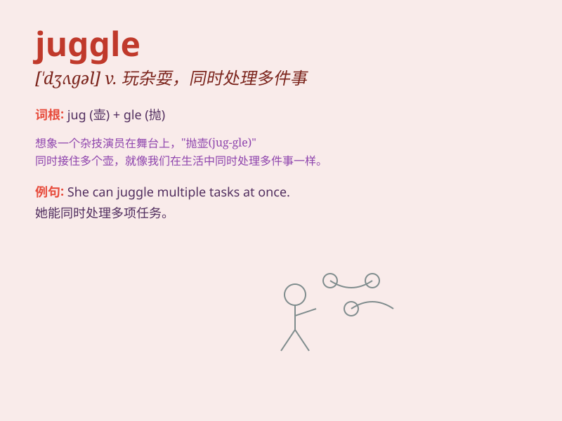

## juggle

**英音:** _[\'dʒʌg(ə)l]_ **美音:** _[\'dʒʌɡl]_

**译义:** *vi.玩戏法,诓骗,篡改vt.耍弄,歪曲,篡改n.玩戏法,魔术,欺骗*

### 短语

+ **juggle with:** _耍弄；摆弄_

+ **juggle for:** _为\...\...尽力兼顾_

+ **juggle between:** _在\...\...之间兼顾_

+ **juggle around:** _到处忙活；到处应付_

+ **juggle something into shape:** _努力把某事做好_

### 例句

#### 例句1

> **She juggles her career and family life with remarkable ease.**

**中文翻译:** 她非常轻松地兼顾事业和家庭生活。

**单词释义:** 兼顾；同时处理

#### 例句2

> **The clown was juggling balls in the circus.**

**中文翻译:** 小丑在马戏团里玩杂耍抛接球。

**单词释义:** 玩杂耍（抛接多个物体）

#### 例句3

> **He tried to juggle the demands of his job and his studies.**

**中文翻译:** 他试图兼顾工作和学习的需求。

**单词释义:** 尽力应付；试图平衡

### 背诵小故事

> A clown was juggling balls at the circus. He threw the balls up in
the air and kept them moving smoothly. Remember, \'juggle\' means to
keep several things moving through the air at the same time.

**一个小丑在马戏团玩杂耍球。他把球抛向空中，并让它们平稳移动。记住，\'juggle\'意思是同时抛接多个东西。**

### 图义

