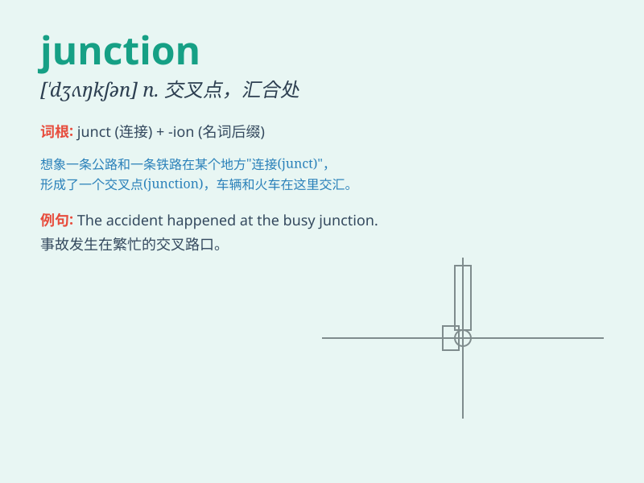

## junction

**英音:** _[\'dʒʌŋ(k)ʃ(ə)n]_ **美音:** _[\'dʒʌŋkʃən]_

**译义:** *n.连接,接合,交叉点,汇合处*

### 短语

+ **road junction:** _道路交叉路口_

+ **railway junction:** _铁路交叉点_

+ **junction box:** _接线盒；分线盒_

+ **junction point:** _连接点；汇合点_

+ **traffic junction:** _交通枢纽_

### 例句

#### 例句1

> **The accident happened at the junction of two main roads.**

**中文翻译:** 事故发生在两条主干道的交叉路口。

**单词释义:** 交叉路口；汇合处

#### 例句2

> **There is a railway junction nearby.**

**中文翻译:** 附近有一个铁路枢纽。

**单词释义:** 枢纽

#### 例句3

> **The junction of these two ideas led to a brilliant solution.**

**中文翻译:** 这两种想法的结合产生了一个绝妙的解决方案。

**单词释义:** 结合；连接

### 背诵小故事

> A car was lost at a junction. It had to decide which way to go.
Finally, it chose the right path and reached its destination. The
junction was like a crossroad of choices.

**一辆汽车在一个交叉路口迷路了。它必须决定走哪条路。最后，它选择了正确的道路并到达了目的地。这个交叉路口就像是选择的十字路口。**

### 图义

