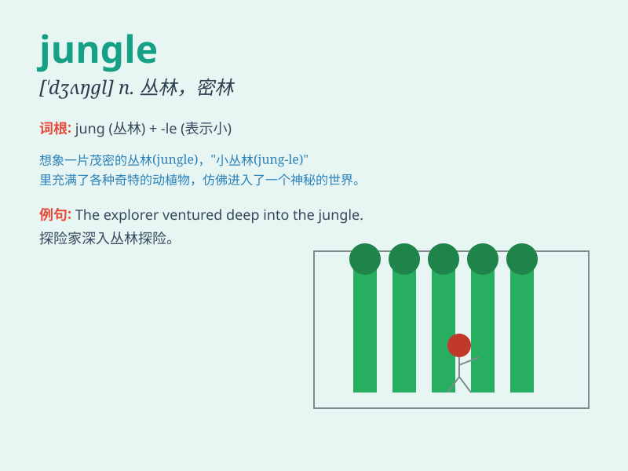

## jungle

**英音:** _[\'dʒʌŋg(ə)l]_ **美音:** _[\'dʒʌŋɡl]_

**译义:** *n.丛林,生死关头*

### 短语

+ **jungle gym:** _儿童攀缘游戏立体构架_

+ **jungle fever:** _丛林热（尤指马来群岛恶性疟疾）_

+ **urban jungle:**
_城市丛林（指城市中人口密集、竞争激烈的环境）_

+ **jungle law:** _弱肉强食的原则；丛林法则_

+ **jungle warfare:** _丛林战_

### 例句

#### 例句1

> **The explorers hacked their way through the jungle.**

**中文翻译:** 探险家们在丛林中艰难地开辟出一条路。

**单词释义:** 丛林

#### 例句2

> **The law of the jungle governs this business world.**

**中文翻译:** 弱肉强食的法则支配着这个商业世界。

**单词释义:** 弱肉强食的地方

#### 例句3

> **The tiger prowled through the jungle in search of prey.**

**中文翻译:** 老虎在丛林中潜行寻找猎物。

**单词释义:** 丛林

### 背诵小故事

> A brave explorer got lost in the jungle. There were tall trees
everywhere, and wild animals lurking. But he didn\'t panic. He followed
a river and finally found his way out. The jungle was a big challenge
but also an adventure.

**一位勇敢的探险家在丛林中迷路了。到处都是高大的树木，还有野生动物潜伏。但他没有惊慌。他沿着一条河走，最终找到了出路。丛林是一个巨大的挑战，但也是一次冒险。**

### 图义

