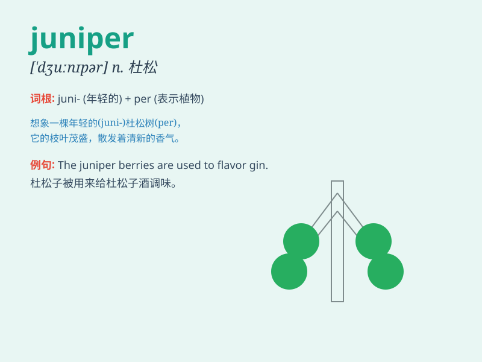

## juniper

**英音:** _[\'dʒuːnɪpə]_ **美音:** _[\'dʒunɪpɚ]_

**译义:** *n.[植]刺柏属丛木或树木*

### 短语

+ **juniper berry:** _杜松子_

+ **juniper bush:** _桧树丛_

+ **common juniper:** _欧洲刺柏_

+ **juniper oil:** _桧油_

+ **juniper tree:** _桧树_

### 例句

#### 例句1

> **The juniper tree in the garden provides a pleasant aroma.**

**中文翻译:** 花园里的杜松树散发出宜人的香气。

**单词释义:** 杜松（树）

#### 例句2

> **The gin was flavored with juniper berries.**

**中文翻译:** 这种杜松子酒是用杜松子调味的。

**单词释义:** 杜松子

#### 例句3

> **We went for a hike in the juniper forest.**

**中文翻译:** 我们在杜松林中徒步旅行。

**单词释义:** 杜松林

### 背诵小故事

> Once upon a time, a little boy was lost in a forest. A friendly fairy
appeared and led him to a juniper tree. The tree\'s unique smell and
beautiful berries helped him find his way home. Remember, juniper means
a type of evergreen tree or shrub.

**从前，有个小男孩在森林里迷路了。一位友好的仙女出现，把他带到了一棵杜松树前。这棵树独特的气味和美丽的浆果帮助他找到了回家的路。记住，juniper
意思是杜松这种常青树或灌木。**

### 图义

