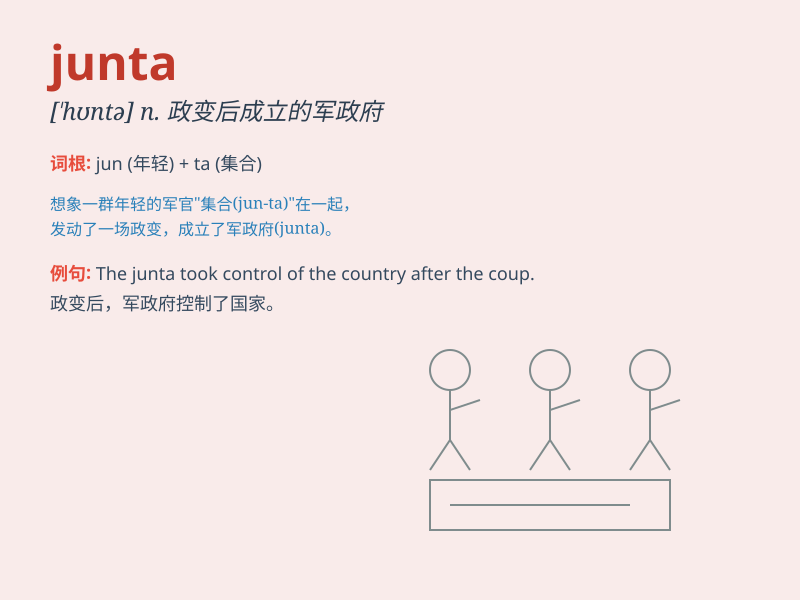

## junta

**英音:** _[\'dʒʌntə; \'hʊ-]_ **美音:** _[\'hʊntə]_

**译义:** *n.小集团,团体,派别*

### 短语

+ **military junta:** _军事政变集团_

+ **junta government:** _军政府_

+ **junta rule:** _军政府统治_

+ **rebel junta:** _叛乱集团_

+ **unelected junta:** _未经选举产生的集团_

### 例句

#### 例句1

> **The junta seized power in a military coup.**

**中文翻译:** 军政府在一次军事政变中夺取了政权。

**单词释义:** （武力夺取政权的）军政府

#### 例句2

> **The junta has been accused of human rights violations.**

**中文翻译:** 该军政府被指控侵犯人权。

**单词释义:** （武力夺取政权的）军政府

#### 例句3

> **The country was ruled by a junta for several years.**

**中文翻译:** 这个国家被一个军政府统治了好几年。

**单词释义:** （武力夺取政权的）军政府

### 背诵小故事

>
想象在一个古老的小镇，有一群人秘密地聚集在一起，他们组成了一个名为\'junta\'的团体，试图掌控小镇的一切。他们的行为神秘而令人不安。

**想象在一个古老的小镇，有一群人秘密聚集组成的团体，叫"军政府；执政团"，他们的行为神秘且令人不安。**

### 图义

