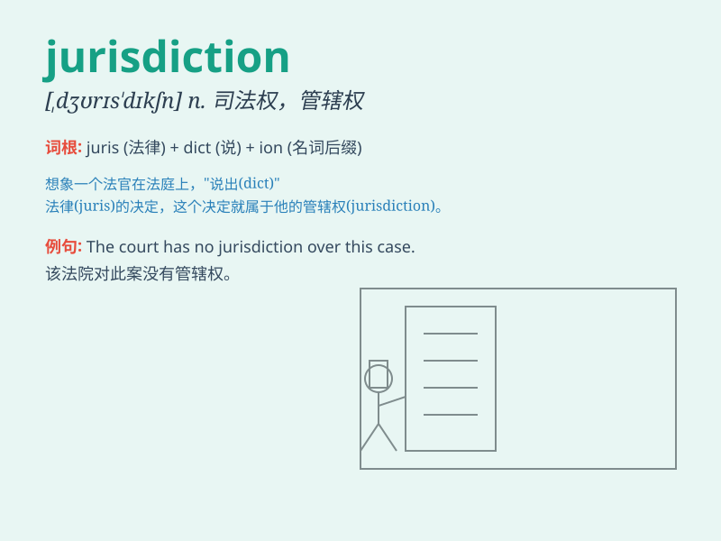

## jurisdiction

**英音:** _[,dʒʊərɪs\'dɪkʃ(ə)n]_ **美音:**
_[,dʒʊrɪs\'dɪkʃən]_

**译义:** *n.权限*

### 短语

+ **territorial jurisdiction:** _属地管辖权_

+ **exclusive jurisdiction:** _专属管辖权_

+ **jurisdiction over:** _对\...\...的管辖权_

+ **competent jurisdiction:** _主管管辖权；合法的管辖权_

+ **original jurisdiction:** _初审管辖权_

### 例句

#### 例句1

> **The court has jurisdiction over criminal cases in this area.**

**中文翻译:** 该法院对这个地区的刑事案件具有管辖权。

**单词释义:** 管辖权

#### 例句2

> **The company\'s activities fall outside the jurisdiction of the
local authorities.**

**中文翻译:** 该公司的活动不在当地当局的管辖范围之内。

**单词释义:** 管辖范围

#### 例句3

> **The international tribunal has jurisdiction to hear the case.**

**中文翻译:** 国际法庭拥有审理这个案件的管辖权。

**单词释义:** 管辖权

### 背诵小故事

> A brave detective was investigating a crime. But he needed to know
the jurisdiction to proceed. Finally, he found out and solved the case.
Jurisdiction means the power or authority to make legal decisions.

**一位勇敢的侦探在调查一起犯罪案件。但他需要知道司法管辖权才能继续。最后，他弄清楚并破了案。Jurisdiction
意思是司法权；管辖权；审判权。**

### 图义

