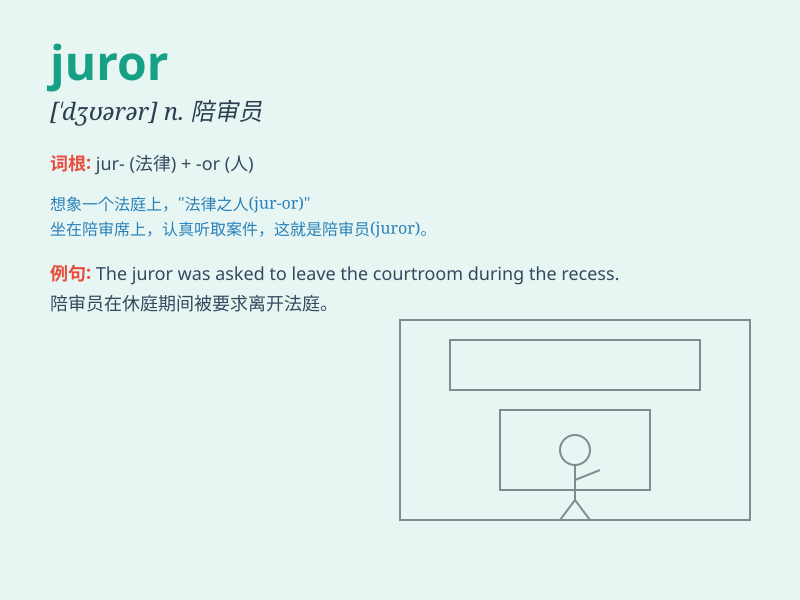

## juror

**英音:** _[\'dʒʊərə]_ **美音:** _[\'dʒʊrɚ]_

**译义:** *n.陪审员,审查委员*

### 短语

+ **impartial juror:** _公正的陪审员_

+ **selected juror:** _被挑选的陪审员_

+ **experienced juror:** _有经验的陪审员_

+ **jury of jurors:** _陪审团成员_

+ **qualified juror:** _合格的陪审员_

### 例句

#### 例句1

> **The juror listened carefully to the testimony.**

**中文翻译:** 这位陪审员认真聆听证词。

**单词释义:** 陪审员

#### 例句2

> **The jurors were selected from a pool of candidates.**

**中文翻译:** 陪审员是从候选人库中选出来的。

**单词释义:** 陪审员

#### 例句3

> **The juror expressed doubt about the defendant\'s guilt.**

**中文翻译:** 这位陪审员对被告的罪行表示怀疑。

**单词释义:** 陪审员

### 背诵小故事

> A juror was chosen to decide a big case. The juror was very nervous
but determined to be fair. He listened carefully to all the evidence and
finally made a wise decision.

**一位陪审员被选中来裁决一个重大案件。这位陪审员非常紧张，但决心做到公平。他仔细聆听了所有的证据，最终做出了明智的决定。**

### 图义

