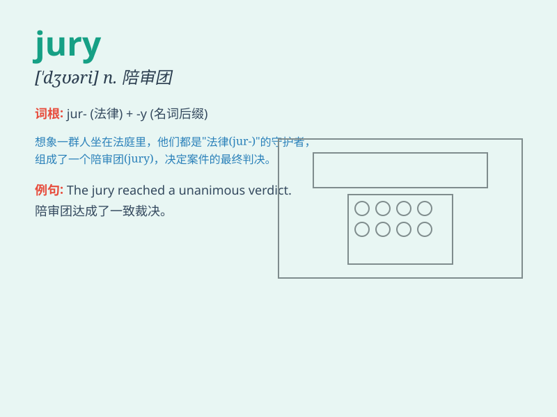

## jury

**英音:** _[\'dʒʊərɪ]_ **美音:** _[\'dʒʊri]_

**译义:** *n.[律] 陪审团,评判委员会,陪审员adj.[海]临时应急的*

### 短语

+ **jury duty:** _陪审义务_

+ **jury box:** _陪审团席_

+ **jury selection:** _陪审团的挑选_

+ **grand jury:** _大陪审团_

+ **jury verdict:** _陪审团裁决_

### 例句

#### 例句1

> **The jury reached a unanimous verdict.**

**中文翻译:** 陪审团达成了一致的裁决。

**单词释义:** 陪审团

#### 例句2

> **She was selected to serve on the jury for the trial.**

**中文翻译:** 她被选入该审判的陪审团。

**单词释义:** 陪审团

#### 例句3

> **The jury\'s decision was final and could not be appealed.**

**中文翻译:** 陪审团的决定是最终的，不能上诉。

**单词释义:** 陪审团

### 背诵小故事

> A group of people were lost in a forest. They needed to decide which
way to go. So they formed a jury to make the choice. Finally, they found
the right path. The jury here means a group making a decision.

**一群人在森林里迷路了。他们需要决定走哪条路。于是他们组成了一个陪审团来做选择。最后，他们找到了正确的路。这里的jury意思是做决定的一组人。**

### 图义

