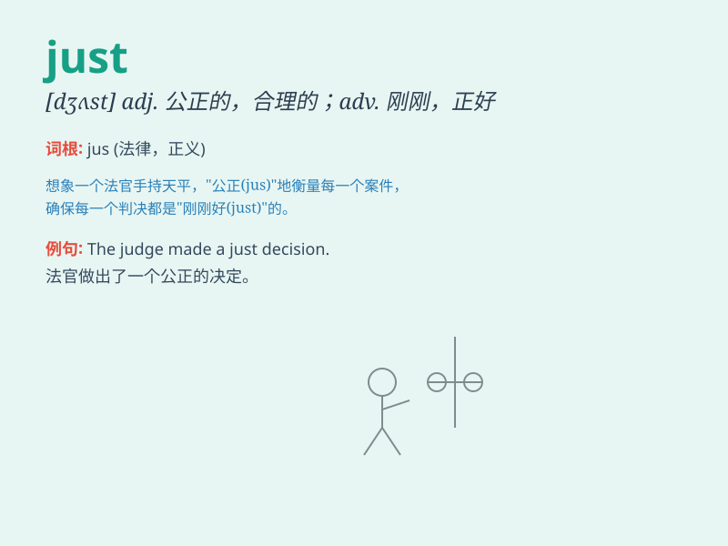

## just

**英音:** _[dʒʌst]_ **美音:** _[dʒʌst]_

**译义:**
*adj.正义的,公正的,正确的,应得的,有充分根据的adv.正好,仅仅,刚才,只是,不过*

### 短语

+ **just now:** _刚才；刚刚_

+ **just about:** _几乎；差不多_

+ **just in case:** _以防万一_

+ **just as:** _正像；正如_

+ **just so:** _正是如此；如你所说_

### 例句

#### 例句1

> **This is just a game.**

**中文翻译:** 这只是一场游戏。

**单词释义:** 仅仅，只是

#### 例句2

> **I just arrived home.**

**中文翻译:** 我刚到家。

**单词释义:** 刚刚

#### 例句3

> **He is just the person we need.**

**中文翻译:** 他正是我们需要的人。

**单词释义:** 正好，恰好

### 背诵小故事

> A judge was about to make a wrong decision. Just in time, a wise man
provided evidence and the judge made a fair judgment. \'Just\' here
means exactly at the right moment or fair and reasonable.

**一位法官即将做出错误的裁决。就在关键时刻，一位智者提供了证据，法官做出了公正的判决。'Just'在这里表示恰好、正当时或者公平合理的。**

### 图义

