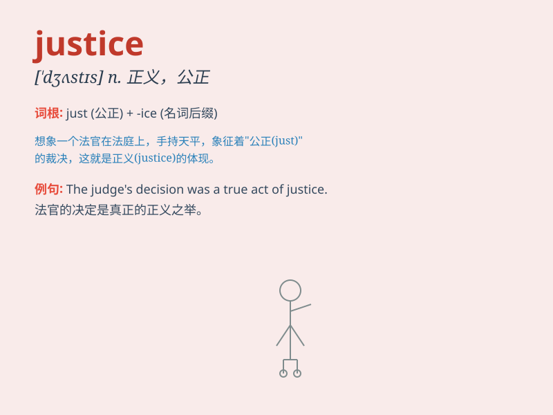

## justice

**英音:** _[\'dʒʌstɪs]_ **美音:** _[\'dʒʌstɪs]_

**译义:** *n.正义,正当,公平,正确,司法,审判,欣赏*

### 短语

+ **social justice:** _社会公正_

+ **criminal justice:** _刑事司法_

+ **poetic justice:** _理想的赏罚_

+ **justice system:** _司法系统_

+ **administer justice:** _执法；主持公道_

### 例句

#### 例句1

> **The criminal was brought to justice.**

**中文翻译:** 罪犯被绳之以法。

**单词释义:** 司法，法律制裁

#### 例句2

> **Justice must be served in this case.**

**中文翻译:** 在这个案子中必须伸张正义。

**单词释义:** 正义，公正

#### 例句3

> **He fought for social justice all his life.**

**中文翻译:** 他一生都在为社会公正而斗争。

**单词释义:** 公正，公平

### 背诵小故事

> A brave knight fought against injustice. He saved the villagers who
were wrongly accused. His actions showed the true meaning of justice -
fairness and righteousness. With justice, everyone got what they
deserved.

**一位勇敢的骑士与不公正作斗争。他拯救了被冤枉的村民。他的行为展现了正义的真正含义------公平和公正。有了正义，每个人都得到了应得的。**

### 图义

