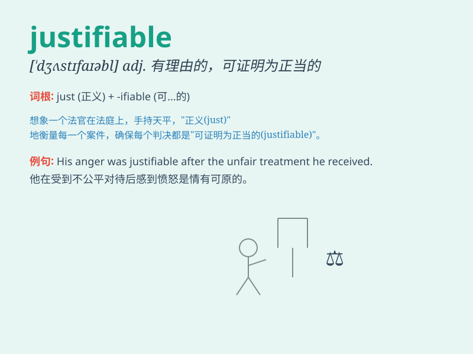

## justifiable

**英音:** _[\'dʒʌstɪ,faɪəb(ə)l]_ **美音:**
_[\'dʒʌstɪfaɪəbl]_

**译义:** *adj.有理由的*

### 短语

+ **justifiable homicide:** _正当杀人_

+ **justifiable defense:** _正当防卫_

+ **justifiable anger:** _情有可原的愤怒_

+ **justifiable claim:** _合理的要求_

+ **justifiable expenditure:** _合理的开支_

### 例句

#### 例句1

> **His actions were justifiable given the circumstances.**

**中文翻译:** 鉴于当时的情况，他的行为是合理的。

**单词释义:** 合理的；可辩解的

#### 例句2

> **It is not always justifiable to use violence to solve
problems.**

**中文翻译:** 使用暴力来解决问题并不总是合理的。

**单词释义:** 正当的；情有可原的

#### 例句3

> **The expense was justifiable for the quality of the product
received.**

**中文翻译:** 鉴于所收到产品的质量，这笔费用是合理的。

**单词释义:** 说得过去的；有理由的

### 背诵小故事

> A thief was caught stealing food. But it turned out he was starving
and had no other choice. His action was justifiable as it was for
survival. Remember, \'justifiable\' means capable of being justified or
defended.

**一个小偷被抓到偷食物。但原来他正在挨饿且别无选择。他的行为是情有可原的，因为是为了生存。记住，\'justifiable\'意思是有理由的；可辩解的；情有可原的。**

### 图义

