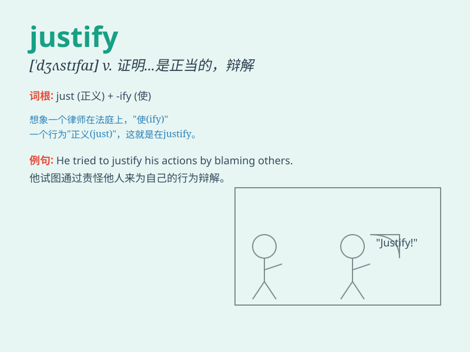

## justify

**英音:** _[\'dʒʌstɪfaɪ]_ **美音:** _[\'dʒʌstə\'fai]_

**译义:** *v.证明\...是正当的*

### 短语

+ **justify doing sth:** _证明做某事是正当的_

+ **justify oneself:** _为自己辩解_

+ **justify one\'s actions:** _证明自己的行为是正当的_

+ **justify the cost:** _证明费用是合理的_

+ **justify the decision:** _证明这个决定是合理的_

### 例句

#### 例句1

> **Nothing can justify your cheating in the exam.**

**中文翻译:** 没有什么能为你考试作弊的行为开脱。

**单词释义:** 证明\...\...是正当的；为\...\...辩护

#### 例句2

> **How can you justify spending so much money on clothes?**

**中文翻译:** 你怎么能为花这么多钱买衣服找理由呢？

**单词释义:** 证明\...\...有理；对\...\...作出解释

#### 例句3

> **The end justifies the means.**

**中文翻译:** 只要目的正当，可以不择手段。

**单词释义:** 证明\...\...是正当的

### 背诵小故事

> A criminal was trying to justify his crime, saying he had no choice.
But the judge firmly said, \'No excuse can justify your wrongdoings!\'
Remember, justify means to give a good reason for something.

**一个罪犯试图为他的罪行辩解，说他别无选择。但法官坚决地说：'没有任何借口能为你的恶行开脱！'记住，justify
意思是为某事给出合理的理由。**

### 图义

