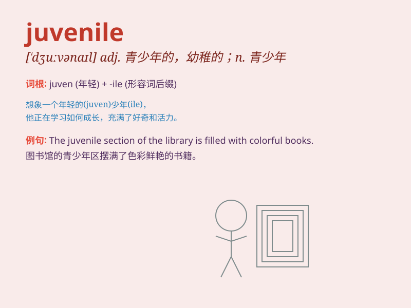

## juvenile

**英音:** _[\'dʒuːvənaɪl]_ **美音:** _[\'dʒʊvənaɪl]_

**译义:** *adj.青少年的,幼稚的n.青少年,少年读物*

### 短语

+ **juvenile delinquency:** _青少年犯罪_

+ **juvenile court:** _少年法庭_

+ **juvenile literature:** _少年文学_

+ **juvenile offender:** _少年犯_

+ **juvenile diabetes:** _青少年糖尿病_

### 例句

#### 例句1

> **The juvenile delinquents were sent to a correctional
facility.**

**中文翻译:** 这些少年犯被送到了教养所。

**单词释义:** 少年的；未成年的

#### 例句2

> **She has a juvenile sense of humor.**

**中文翻译:** 她有一种孩子气的幽默感。

**单词释义:** 孩子气的；幼稚的

#### 例句3

> **The book is suitable for juvenile readers.**

**中文翻译:** 这本书适合青少年读者。

**单词释义:** 青少年的

### 背诵小故事

> A little boy was caught stealing candy. When the police came, they
said, \'Don\'t do such juvenile things.\' It means behaving like a young
and immature person.

**一个小男孩偷糖果被抓了。警察来的时候说：'别做这种幼稚的事。'
这意味着像年轻不成熟的人那样行事。**

### 图义

