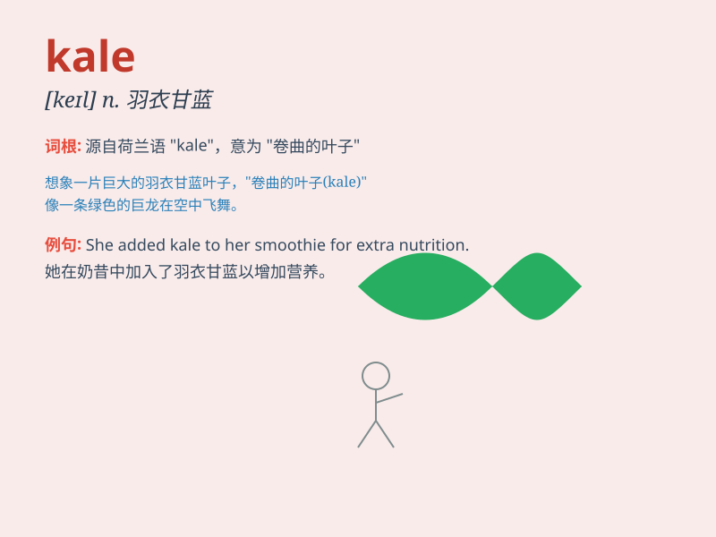

## kale

**英音:** _[keɪl]_ **美音:** _[kel]_

**译义:** *n.羽衣甘蓝*

### 短语

+ **curly kale:** _羽衣甘蓝_

+ **kale soup:** _甘蓝汤_

+ **kale salad:** _甘蓝沙拉_

+ **fried kale:** _炒甘蓝_

+ **baked kale:** _烤甘蓝_

### 例句

#### 例句1

> **I added some kale to my salad for extra nutrients.**

**中文翻译:** 我在沙拉中添加了一些羽衣甘蓝以获取额外的营养。

**单词释义:** 羽衣甘蓝（一种蔬菜）

#### 例句2

> **The farmer harvested a large amount of kale this season.**

**中文翻译:** 这个季节农民收获了大量羽衣甘蓝。

**单词释义:** 羽衣甘蓝（一种蔬菜）

#### 例句3

> **She prefers kale over spinach for its unique flavor.**

**中文翻译:** 与菠菜相比，她更喜欢羽衣甘蓝，因为它具有独特的风味。

**单词释义:** 羽衣甘蓝（一种蔬菜）

### 背诵小故事

> A little rabbit was lost in a big garden. It was very hungry and
found a strange green vegetable, which was kale. The rabbit ate it and
felt full and happy.

**一只小兔子在一个大花园里迷路了。它非常饿，然后发现了一种奇怪的绿色蔬菜，这就是羽衣甘蓝。小兔子吃了它，感觉饱饱的，很开心。**

### 图义

