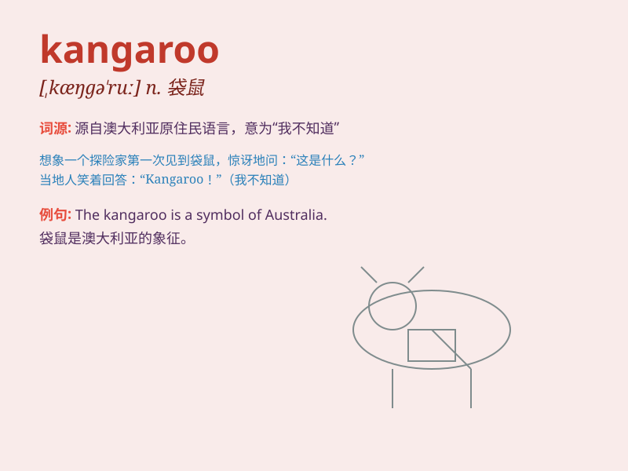

## kangaroo

**英音:** _[,kæŋgə\'ruː]_ **美音:** _[,kæŋɡə\'ru]_

**译义:** *n.[动]袋鼠*

### 短语

+ **kangaroo court:** _私设的法庭；不公正的法庭_

+ **kangaroo rat:** _更格卢鼠_

+ **kangaroo paw:** _袋鼠爪花_

+ **kangaroo jump:** _袋鼠跳_

+ **kangaroo island:** _袋鼠岛（澳大利亚岛屿）_

### 例句

#### 例句1

> **The kangaroo hopped across the field.**

**中文翻译:** 袋鼠跳跃着穿过田野。

**单词释义:** 袋鼠

#### 例句2

> **I saw a mother kangaroo with her joey in her pouch.**

**中文翻译:** 我看到一只袋鼠妈妈和她的小袋鼠在她的育儿袋里。

**单词释义:** 袋鼠

#### 例句3

> **The zoo has several kangaroos from Australia.**

**中文翻译:** 动物园里有几只来自澳大利亚的袋鼠。

**单词释义:** 袋鼠

### 背诵小故事

> A little boy was lost in the forest. Suddenly, a kangaroo appeared
and hopped towards him. The boy was scared at first, but then the kind
kangaroo carried him back home. Remember, kangaroo, the friendly jumper!

**一个小男孩在森林里迷路了。突然，一只袋鼠出现并朝他跳过来。男孩起初很害怕，但随后这只善良的袋鼠把他驮回了家。记住，kangaroo，友好的跳跃者！**

### 图义

