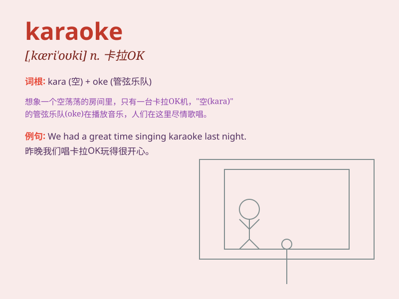

## karaoke

**英音:** _[ˌkæriˈəʊki]_ **美音:** _[ˌkæriˈoʊki]_

**译义:** *n.卡拉 OK*

### 短语

+ **karaoke bar:** _卡拉 OK 酒吧_

+ **karaoke machine:** _卡拉 OK 机_

+ **karaoke night:** _卡拉 OK 之夜_

+ **karaoke party:** _卡拉 OK 派对_

+ **sing karaoke:** _唱卡拉 OK_

### 例句

#### 例句1

> **We had a great time singing karaoke at the party last night.**

**中文翻译:** 昨晚在聚会上我们唱卡拉 OK 玩得很开心。

**单词释义:** 卡拉 OK

#### 例句2

> **The bar offers karaoke every Friday night.**

**中文翻译:** 这家酒吧每周五晚上都提供卡拉 OK 服务。

**单词释义:** 卡拉 OK

#### 例句3

> **She loves to perform karaoke when she\'s with her friends.**

**中文翻译:** 当她和朋友们在一起时，她喜欢唱卡拉 OK 表演。

**单词释义:** 卡拉 OK

### 背诵小故事

> 小明参加聚会，大家玩得很嗨。有人提议去唱
karaoke，小明一开始很紧张，但在朋友的鼓励下，勇敢拿起话筒，尽情歌唱，度过了欢乐的时光。

**小明参加聚会，大家提议去唱卡拉
OK，小明起初紧张，在朋友鼓励下勇敢歌唱，度过欢乐时光。**

### 图义

