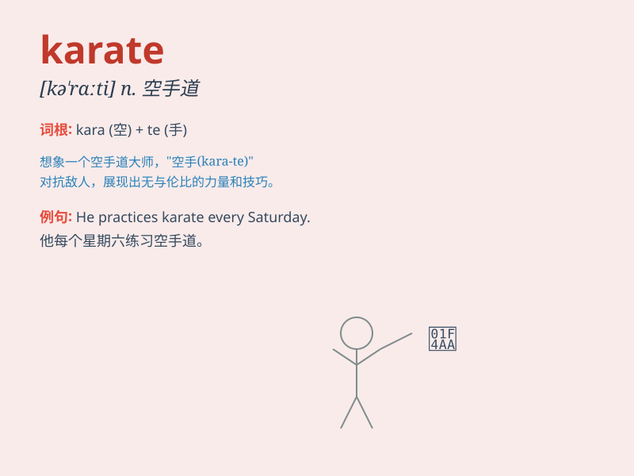

## karate

**英音:** _[kəˈrɑːti]_ **美音:** _[kəˈrɑːti]_

**译义:** *n.[日] 空手道(日本的一种徒手自卫武术)*

### 短语

+ **karate chop:** _空手道劈击_

+ **karate dojo:** _空手道道场_

+ **karate uniform:** _空手道服_

+ **karate master:** _空手道大师_

+ **karate training:** _空手道训练_

### 例句

#### 例句1

> **She has been practicing karate for five years.**

**中文翻译:** 她练习空手道已有五年了。

**单词释义:** 空手道（一种武术）

#### 例句2

> **He won the karate championship last month.**

**中文翻译:** 上个月他赢得了空手道冠军。

**单词释义:** 空手道（一种武术比赛项目）

#### 例句3

> **Karate helps improve one\'s self-defense skills.**

**中文翻译:** 空手道有助于提高自卫技能。

**单词释义:** 空手道（一种技能训练方式）

### 背诵小故事

> One day, a brave boy named Tom was walking in the street. Suddenly, a
group of bad guys appeared and wanted to bully him. But Tom was not
afraid. He used his karate skills and defeated the bad guys easily.
Everyone cheered for him.

**一天，一个叫汤姆的勇敢男孩正在街上走。突然，一群坏人出现想欺负他。但汤姆并不害怕。他用他的空手道技能轻松打败了坏人。大家都为他欢呼。**

### 图义

