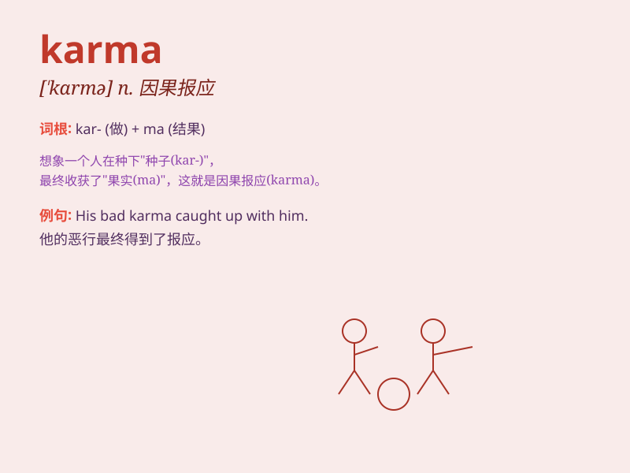

## karma

**英音:** _[\'kɑːmə; \'kɜːmə]_ **美音:** _[\'kɑrmə]_

**译义:** *n.因缘,因果报应*

### 短语

+ **good karma:** _善业；好的因果报应_

+ **bad karma:** _恶业；坏的因果报应_

+ **karma yoga:** _业瑜伽_

+ **past karma:** _过去的业力_

+ **karma theory:** _业力理论_

### 例句

#### 例句1

> **She believes in karma and tries to do good deeds every day.**

**中文翻译:** 她相信因果报应，每天都努力做好事。

**单词释义:** 因果报应

#### 例句2

> **His bad karma finally caught up with him.**

**中文翻译:** 他的恶报终于降临了。

**单词释义:** 报应；因果

#### 例句3

> **I think karma will bring justice in the end.**

**中文翻译:** 我认为因果最终会带来正义。

**单词释义:** 因果；命运

### 背诵小故事

> A man was always mean and selfish. But one day, he had an accident.
People said it was his karma. Because bad actions lead to bad results.
Karma means the sum of a person\'s actions in this and previous states
of existence, influencing their future.

**一个男人总是刻薄又自私。但有一天，他遭遇了一场事故。人们说这是他的业力。因为坏的行为导致坏的结果。karma
指的是一个人今生和前世的行为总和，会影响其未来。**

### 图义

