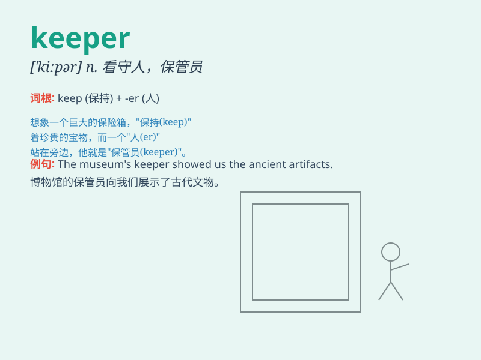

## keeper

**英音:** _[\'kiːpə]_ **美音:** _[\'kipɚ]_

**译义:** *n.监护人,管理人,看守人,保管人*

### 短语

+ **zoo keeper:** _动物园管理员_

+ **goal keeper:** _守门员_

+ **store keeper:** _仓库管理员_

+ **sheep keeper:** _牧羊人_

+ **house keeper:** _管家_

### 例句

#### 例句1

> **The zoo keeper feeds the animals every day.**

**中文翻译:** 动物园管理员每天给动物喂食。

**单词释义:** 管理员

#### 例句2

> **She is a good goal keeper in the football team.**

**中文翻译:** 她在足球队里是一名优秀的守门员。

**单词释义:** 守门员

#### 例句3

> **The store keeper is responsible for the inventory.**

**中文翻译:** 店铺管理员负责库存。

**单词释义:** 管理员

### 背诵小故事

> A zoo keeper was very tired after a long day. But when a little
monkey got lost, the keeper found it and brought it back safely. The
keeper\'s job is to take care and protect the animals.

**一位动物园管理员在漫长的一天后非常疲惫。但是当一只小猴子走失时，管理员找到了它并将其安全带回。管理员的工作就是照顾和保护动物。**

### 图义

