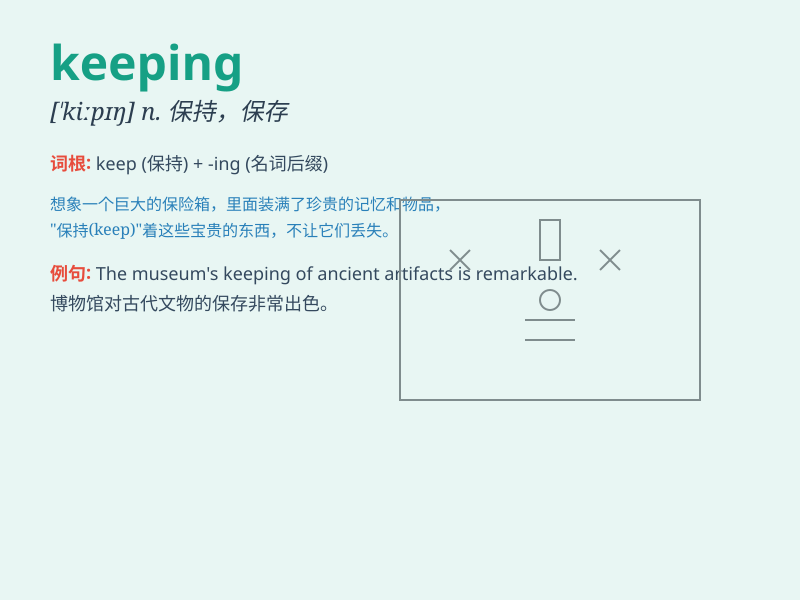

## keeping

**英音:** _[\'kiːpɪŋ]_ **美音:** _[\'kipɪŋ]_

**译义:** *n.保守,看守,遵守,饲养*

### 短语

+ **keeping records:** _保存记录_

+ **keeping secrets:** _保守秘密_

+ **keeping fit:** _保持健康_

+ **keeping time:** _计时_

+ **keeping pets:** _养宠物_

### 例句

#### 例句1

> **The company is famous for its excellent record keeping.**

**中文翻译:** 这家公司因其出色的记录保存而闻名。

**单词释义:** 保存；保管

#### 例句2

> **She enjoys the keeping of pets.**

**中文翻译:** 她喜欢养宠物。

**单词释义:** 饲养

#### 例句3

> **The secret was safe in his keeping.**

**中文翻译:** 这个秘密在他的保管下是安全的。

**单词释义:** 保管；守护

### 背诵小故事

> One day, a little monkey was responsible for keeping the bananas
safe. It was a hard task, but it did it carefully. Keeping means to have
or retain something.

**一天，一只小猴子负责保管香蕉的安全。这是一项艰巨的任务，但它做得很仔细。keeping
意思是拥有或保留某物。**

### 图义

