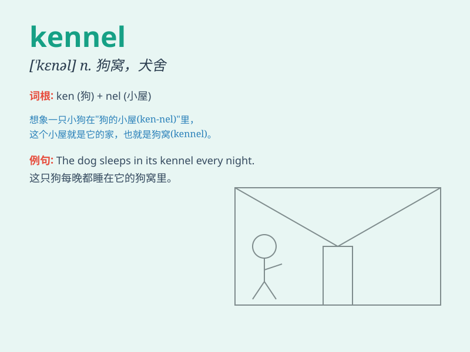

## kennel

**英音:** _[\'ken(ə)l]_ **美音:** _[\'kɛnl]_

**译义:** *n.狗窝,狗屋,阴沟vt.置于狗窝,宿于狗舍vi.进狗窝*

### 短语

+ **kennel club:** _养狗俱乐部_

+ **kennel cough:** _犬舍咳（一种犬类传染病）_

+ **boarding kennel:** _寄养犬舍_

+ **kennel maid:** _犬舍女仆_

+ **kennel fever:** _犬舍热（一种疾病）_

### 例句

#### 例句1

> **The dog was kept in a kennel at night.**

**中文翻译:** 这只狗晚上被关在狗舍里。

**单词释义:** 狗舍

#### 例句2

> **We need to clean the kennel regularly to keep it hygienic.**

**中文翻译:** 我们需要定期清理狗舍以保持卫生。

**单词释义:** 狗舍

#### 例句3

> **The kennel was too small for the big dog.**

**中文翻译:** 这个狗舍对这只大狗来说太小了。

**单词释义:** 狗舍

### 背诵小故事

> A poor little puppy was lost and found itself in a strange kennel. It
was scared at first but then felt a bit safe. The kennel became its
temporary home.

**一只可怜的小狗迷路了，发现自己在一个陌生的狗舍里。一开始它很害怕，但后来觉得有点安全。这个狗舍成了它暂时的家。**

### 图义

