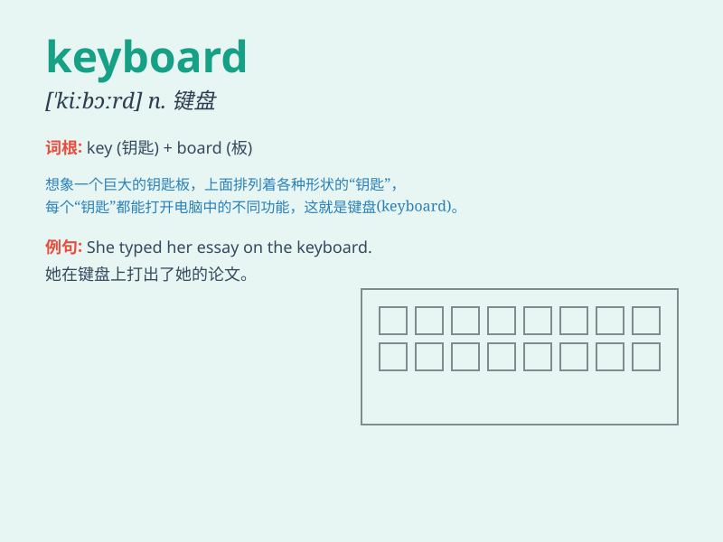

## keyboard

**英音:** _[\'kiːbɔːd]_ **美音:** _[\'ki\'bɔrd]_

**译义:** *n.[计] 键盘*

### 短语

+ **computer keyboard:** _电脑键盘_

+ **electronic keyboard:** _电子键盘_

+ **keyboard shortcut:** _键盘快捷键_

+ **keyboard player:** _键盘手_

+ **wireless keyboard:** _无线键盘_

### 例句

#### 例句1

> **I\'m typing on the keyboard.**

**中文翻译:** 我正在键盘上打字。

**单词释义:** 键盘

#### 例句2

> **The keyboard of this computer is very comfortable to use.**

**中文翻译:** 这台电脑的键盘用起来非常舒服。

**单词释义:** 键盘

#### 例句3

> **He cleaned the keyboard carefully.**

**中文翻译:** 他仔细地清理了键盘。

**单词释义:** 键盘

### 背诵小故事

> One day, a little monkey found a magic \'keyboard\' in the forest.
When he touched the keys, beautiful music came out. He was so happy and
realized this keyboard could bring joy and surprise.

**有一天，一只小猴子在森林里发现了一个神奇的"键盘"。当它触摸按键时，美妙的音乐就出来了。它非常高兴，意识到这个键盘能带来快乐和惊喜。**

### 图义

