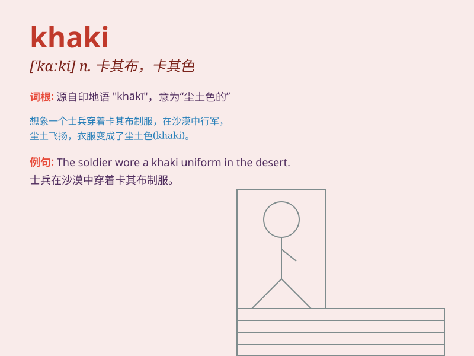

## khaki

**英音:** _[\'kɑːkɪ]_ **美音:** _[\'kɑki]_

**译义:** *adj.黄褐色n.卡其布*

### 短语

+ **khaki trousers:** _卡其裤_

+ **khaki shirt:** _卡其衬衫_

+ **khaki uniform:** _卡其制服_

+ **khaki fabric:** _卡其布_

+ **khaki color:** _卡其色_

### 例句

#### 例句1

> **He wore a khaki shirt and jeans.**

**中文翻译:** 他穿着一件卡其色的衬衫和牛仔裤。

**单词释义:** 卡其色的（形容衬衫的颜色）

#### 例句2

> **The khaki trousers are very comfortable.**

**中文翻译:** 这条卡其色的裤子非常舒适。

**单词释义:** 卡其色的（形容裤子的颜色）

#### 例句3

> **She has a khaki jacket for outdoor activities.**

**中文翻译:** 她有一件用于户外活动的卡其色夹克。

**单词释义:** 卡其色的（形容夹克的颜色）

### 背诵小故事

> A soldier was on a mission in the desert. The sun was scorching, and
his uniform was khaki. It helped him blend in with the sandy terrain.
Thanks to the khaki color, he remained hidden from the enemy.

**一名士兵在沙漠执行任务。太阳炽热，他的制服是卡其色的。这帮助他与沙地地形融为一体。多亏了卡其色，他得以躲避敌人。**

### 图义

