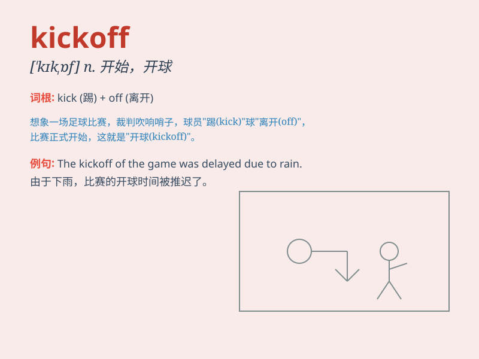

## kickoff

**英音:** _[ˈkɪkˈɒf]_ **美音:** _[ˈkɪˌkɔf]_

**译义:** *n.(足球)开球,(社会集会等)开始*

### 短语

+ **kickoff meeting:** _启动会议；开工会议_

+ **kickoff time:** _开球时间；开始时间_

+ **project kickoff:** _项目启动_

+ **kickoff event:** _开场活动；启动仪式_

+ **kickoff party:** _开场派对；启动聚会_

### 例句

#### 例句1

> **The football game will have a kickoff at 3 p.m.**

**中文翻译:** 这场足球比赛将在下午 3 点开球。

**单词释义:** （足球比赛等的）开球

#### 例句2

> **The kickoff of the new project was very successful.**

**中文翻译:** 新项目的启动非常成功。

**单词释义:** （活动、项目等的）开始

#### 例句3

> **The party had a great kickoff with a live band performance.**

**中文翻译:** 聚会以现场乐队表演拉开了精彩的序幕。

**单词释义:** （聚会、活动等的）开场

### 背诵小故事

> A football game was about to start. The referee blew the whistle and
made a powerful kickoff. The ball flew high and the teams rushed to
chase it. This was the exciting kickoff of the match.

**一场足球比赛即将开始。裁判吹响哨子，用力开球。球高高飞起，两队队员都冲过去追逐。这就是比赛令人兴奋的开球时刻。**

### 图义

