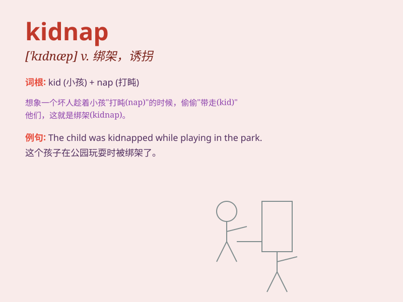

## kidnap

**英音:** _[\'kɪdnæp]_ **美音:** _[\'kɪdnæp]_

**译义:** *vt.诱拐(小孩),绑架,勒赎*

### 短语

+ **kidnap attempt:** _绑架企图_

+ **kidnap victim:** _被绑架的受害者_

+ **kidnap case:** _绑架案件_

+ **prevent a kidnapping:** _防止绑架_

+ **fall victim to kidnapping:** _成为绑架的受害者_

### 例句

#### 例句1

> **The criminal was arrested for kidnapping a wealthy
businessman.**

**中文翻译:** 这名罪犯因绑架一位富商而被捕。

**单词释义:** 绑架

#### 例句2

> **She was terrified that her child might be kidnapped.**

**中文翻译:** 她很害怕她的孩子可能会被绑架。

**单词释义:** 绑架

#### 例句3

> **The police are working hard to rescue the kidnapped girl.**

**中文翻译:** 警方正在努力营救被绑架的女孩。

**单词释义:** 被绑架的

### 背诵小故事

> One day, a bad guy saw a little kid playing alone. He had a bad idea
and decided to kidnap the kid for money. But the police were smart and
caught him quickly. Remember, \'kidnap\' means to take someone away
illegally by force.

**有一天，一个坏人看到一个小孩独自玩耍。他有了个坏主意，决定绑架这个小孩来要钱。但警察很聪明，很快就抓住了他。记住，'kidnap'意思是用暴力非法带走某人。**

### 图义

