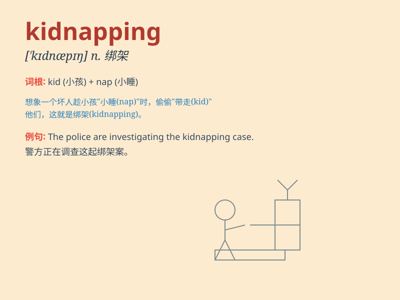

## kidnapping

**英音:** _[\'kɪdnæpɪŋ]_ **美音:** _[\'kɪdnæpɪŋ]_

**译义:** *n.诱拐,拐骗*

### 短语

+ **attempted kidnapping:** _绑架未遂_

+ **prevent kidnapping:** _防止绑架_

+ **victim of kidnapping:** _绑架受害者_

+ **investigate kidnapping:** _调查绑架案_

+ **serial kidnapping:** _连环绑架_

### 例句

#### 例句1

> **The kidnapping of the child caused widespread panic in the
community.**

**中文翻译:** 孩子的绑架事件在社区引起了广泛的恐慌。

**单词释义:** 绑架（行为）

#### 例句2

> **He was arrested on suspicion of kidnapping.**

**中文翻译:** 他因涉嫌绑架而被捕。

**单词释义:** 绑架

#### 例句3

> **The police are investigating the recent kidnapping case.**

**中文翻译:** 警方正在调查最近的这起绑架案。

**单词释义:** 绑架

### 背诵小故事

> One night, a bad man was lurking in the dark. He saw a little girl
and planned a kidnapping. He grabbed her and ran away. But the police
were smart and caught him. Remember, kidnapping is a very bad crime!

**一天晚上，一个坏人潜伏在黑暗中。他看到一个小女孩并计划了一起绑架。他抓住她跑了。但警察很聪明，抓住了他。记住，绑架是非常严重的罪行！**

### 图义

