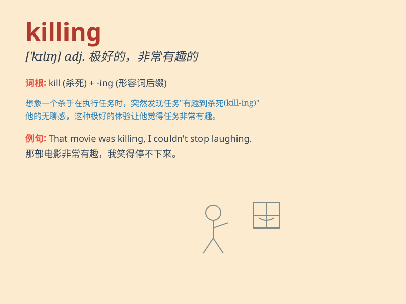

## killing

**英音:** _[\'kɪlɪŋ]_ **美音:** _[\'kɪlɪŋ]_

**译义:**
*n.杀害,猎护品,赚得的一笔大钱adj.致死的,使人疲乏的v.杀害*

### 短语

+ **killing field:** _杀戮场_

+ **killing machine:** _杀人机器_

+ **make a killing:** _发大财；赚大钱_

+ **killing spree:** _杀戮狂欢；疯狂杀戮_

+ **killing frost:** _严霜；毁灭性的霜冻_

### 例句

#### 例句1

> **The heatwave has been a killing blow to the crops.**

**中文翻译:** 这次热浪对农作物是致命的打击。

**单词释义:** 致命的

#### 例句2

> **He made a killing in the stock market.**

**中文翻译:** 他在股市中赚了大钱。

**单词释义:** 大赚一笔

#### 例句3

> **The crime scene was a killing field.**

**中文翻译:** 犯罪现场是个杀戮之地。

**单词释义:** 杀戮的

### 背诵小故事

> A detective was on a mission to solve a mysterious killing. The
victim was found in a dark alley. The detective had to find the culprit.
It was a challenging case, but he was determined to solve this killing.

**一位侦探正在执行一项任务，去侦破一起神秘的杀人案。受害者被发现于一条黑暗的小巷。侦探必须找出凶手。这是一个具有挑战性的案子，但他决心侦破这起杀人案。**

### 图义

