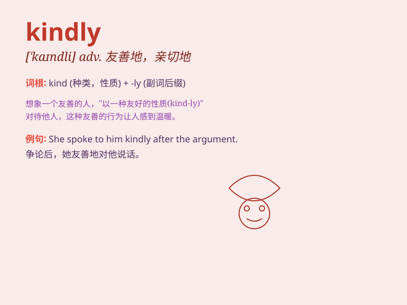

## kindly

**英音:** _[\'kaɪndlɪ]_ **美音:** _[\'kaɪndli]_

**译义:** *adj.和善的,温和的,好意的,爽快的adv.温和地,亲切地*

### 短语

+ **kindly heart:** _善良的心_

+ **kindly smile:** _亲切的微笑_

+ **kindly reminder:** _善意的提醒_

+ **kindly advice:** _友善的建议_

+ **kindly gesture:** _友好的姿态_

### 例句

#### 例句1

> **Would you kindly close the door?**

**中文翻译:** 您能好心地关一下门吗？

**单词释义:** 好心地；亲切地

#### 例句2

> **He kindly offered to help me.**

**中文翻译:** 他亲切地主动提出帮助我。

**单词释义:** 亲切地；友好地

#### 例句3

> **Kindly speak more slowly. I can\'t follow you.**

**中文翻译:** 请说得慢一点。我跟不上您。

**单词释义:** 请；恳请

### 背诵小故事

> One day, a little girl got lost. A kindly old man helped her find her
way home. His kind and friendly behavior made the girl feel safe and
happy. Kindly here means in a kind and friendly way.

**一天，一个小女孩迷路了。一位和蔼的老人帮她找到了回家的路。他友善的行为让小女孩感到安全和开心。这里的
kindly 意思是以友善亲切的方式。**

### 图义

