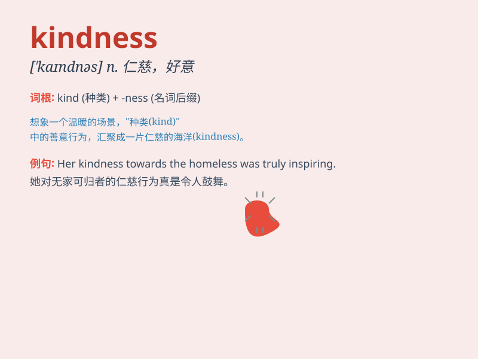

## kindness

**英音:** _[\'kaɪn(d)nɪs]_ **美音:** _[\'kaɪndnəs]_

**译义:** *n.仁慈,亲切,好意,善意*

### 短语

+ **show kindness:** _表示友善_

+ **act of kindness:** _善举_

+ **out of kindness:** _出于好意_

+ **kindness and generosity:** _善良和慷慨_

+ **receive kindness:** _接受善意_

### 例句

#### 例句1

> **Her kindness towards strangers is remarkable.**

**中文翻译:** 她对陌生人的友善非常引人注目。

**单词释义:** 友善，好意

#### 例句2

> **I was touched by his kindness when he helped me carry the heavy
box.**

**中文翻译:** 当他帮我搬那个重箱子时，我被他的善良所感动。

**单词释义:** 善良，仁慈

#### 例句3

> **We should repay kindness with kindness.**

**中文翻译:** 我们应该以善报善。

**单词释义:** 好意，友好的行为

### 背诵小故事

> One day, when I was lost and sad, a stranger showed me kindness. She
helped me find my way home and gave me a warm smile. Her act of kindness
made my day and I\'ll never forget it.

**有一天，当我迷路且伤心时，一个陌生人向我展现了善意。她帮我找到了回家的路，并给了我一个温暖的微笑。她的善意之举让我开心了一整天，我永远不会忘记。**

### 图义

